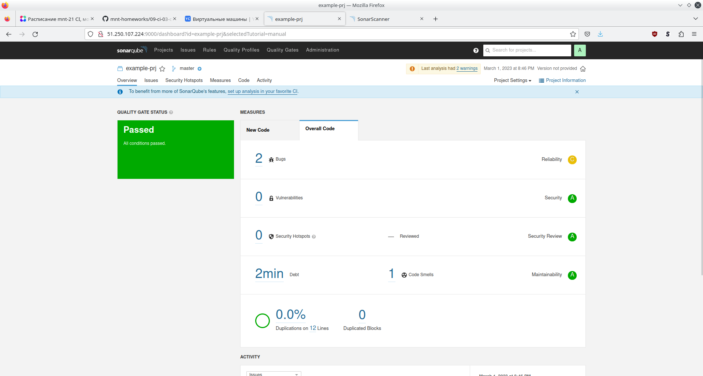
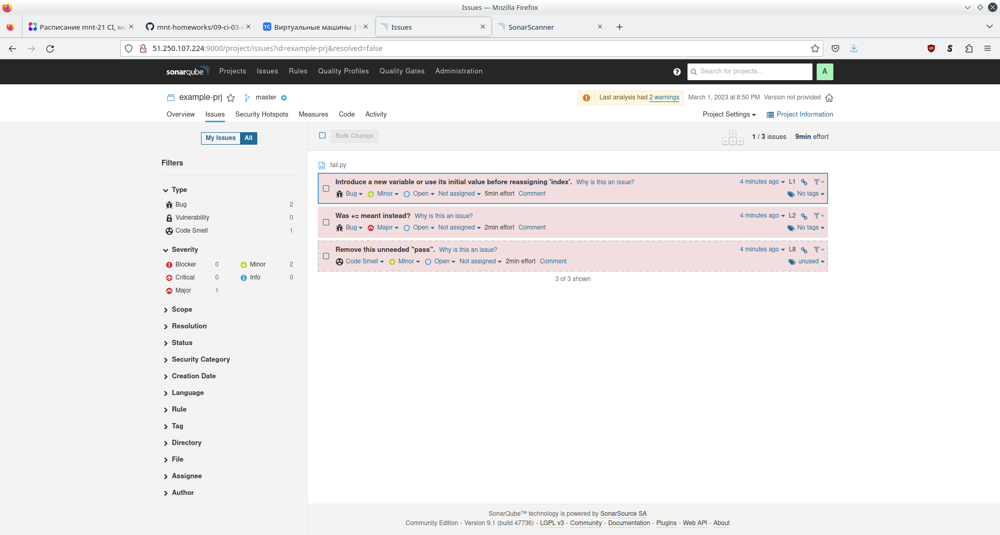
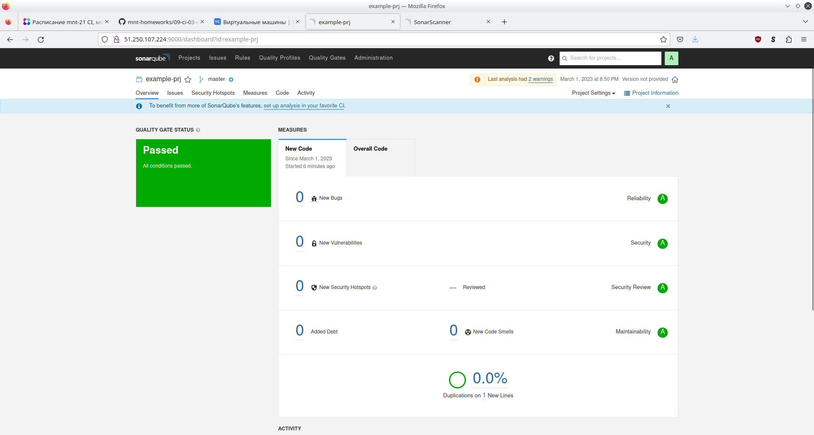
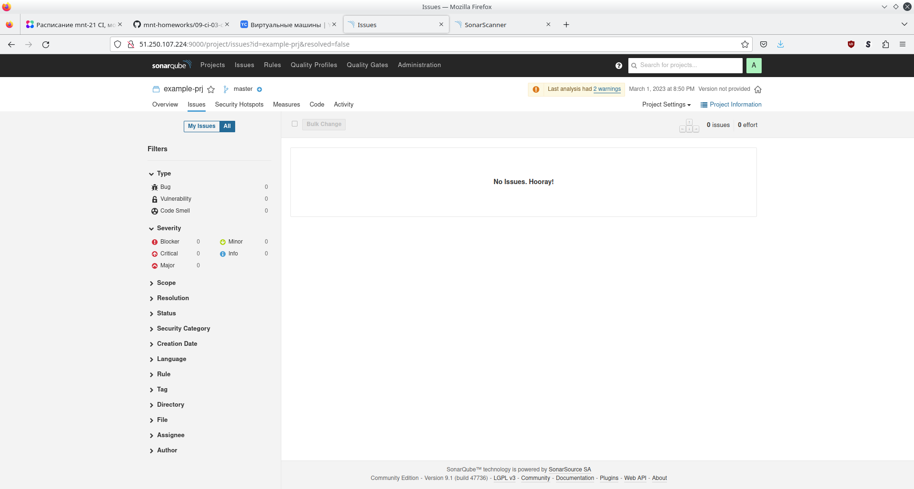
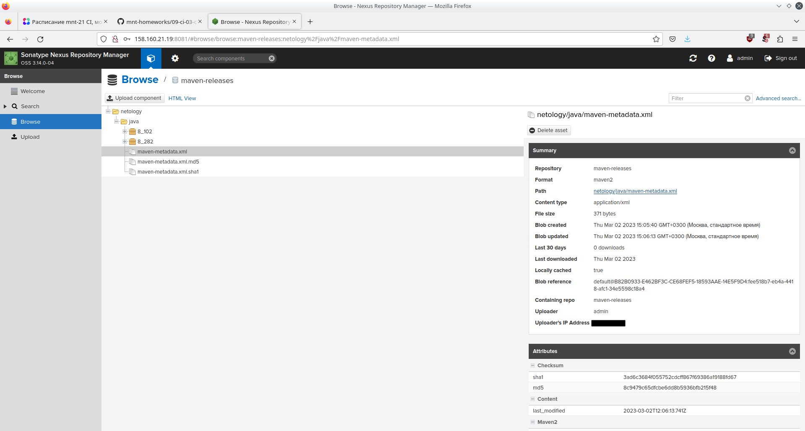

# Домашнее задание к занятию 9 «Процессы CI/CD»
## Знакомоство с SonarQube







## Знакомство с Nexus


[maven-metadata.xml](09-ci/03-cicd/maven-metadata.xml)</br>

## Знакомство с Maven

```console
user@host:~/Облако/Documents/Netology/DEVOPS-22/devops-netology/09-ci/03-cicd/mvn$ mvn package
[INFO] Scanning for projects...
[INFO] 
[INFO] --------------------< com.netology.app:simple-app >---------------------
[INFO] Building simple-app 1.0-SNAPSHOT
[INFO]   from pom.xml
[INFO] --------------------------------[ jar ]---------------------------------
Downloading from my-repo: http://158.160.21.19:8081/repository/maven-public/netology/java/8_282/java-8_282.pom
[WARNING] The POM for netology:java:tar.gz:distrib:8_282 is missing, no dependency information available
Downloading from my-repo: http://158.160.21.19:8081/repository/maven-public/netology/java/8_282/java-8_282-distrib.tar.gz
Downloaded from my-repo: http://158.160.21.19:8081/repository/maven-public/netology/java/8_282/java-8_282-distrib.tar.gz (115 B at 2.8 kB/s)
[INFO] 
[INFO] --- resources:3.3.0:resources (default-resources) @ simple-app ---
[WARNING] Using platform encoding (UTF-8 actually) to copy filtered resources, i.e. build is platform dependent!
[INFO] skip non existing resourceDirectory /home/user/Облако/Documents/Netology/DEVOPS-22/devops-netology/09-ci/03-cicd/mvn/src/main/resources
[INFO] 
[INFO] --- compiler:3.10.1:compile (default-compile) @ simple-app ---
[INFO] No sources to compile
[INFO] 
[INFO] --- resources:3.3.0:testResources (default-testResources) @ simple-app ---
[WARNING] Using platform encoding (UTF-8 actually) to copy filtered resources, i.e. build is platform dependent!
[INFO] skip non existing resourceDirectory /home/user/Облако/Documents/Netology/DEVOPS-22/devops-netology/09-ci/03-cicd/mvn/src/test/resources
[INFO] 
[INFO] --- compiler:3.10.1:testCompile (default-testCompile) @ simple-app ---
[INFO] No sources to compile
[INFO] 
[INFO] --- surefire:3.0.0-M8:test (default-test) @ simple-app ---
[INFO] No tests to run.
[INFO] 
[INFO] --- jar:3.3.0:jar (default-jar) @ simple-app ---
[WARNING] JAR will be empty - no content was marked for inclusion!
[INFO] Building jar: /home/user/Облако/Documents/Netology/DEVOPS-22/devops-netology/09-ci/03-cicd/mvn/target/simple-app-1.0-SNAPSHOT.jar
[INFO] ------------------------------------------------------------------------
[INFO] BUILD SUCCESS
[INFO] ------------------------------------------------------------------------
[INFO] Total time:  1.076 s
[INFO] Finished at: 2023-03-02T15:29:42+03:00
[INFO] ------------------------------------------------------------------------

user@host:~/Облако/Documents/Netology/DEVOPS-22/devops-netology/09-ci/03-cicd/mvn$ ls -l ~/.m2/repository/netology/java/8_282/
итого 16
-rw-r--r-- 1 user user 115 мар  2 15:29 java-8_282-distrib.tar.gz
-rw-r--r-- 1 user user  40 мар  2 15:29 java-8_282-distrib.tar.gz.sha1
-rw-r--r-- 1 user user 784 мар  2 15:29 java-8_282.pom.lastUpdated
-rw-r--r-- 1 user user 175 мар  2 15:29 _remote.repositories

```

[pom.xml](09-ci/03-cicd/mvn/pom.xml)</br>
