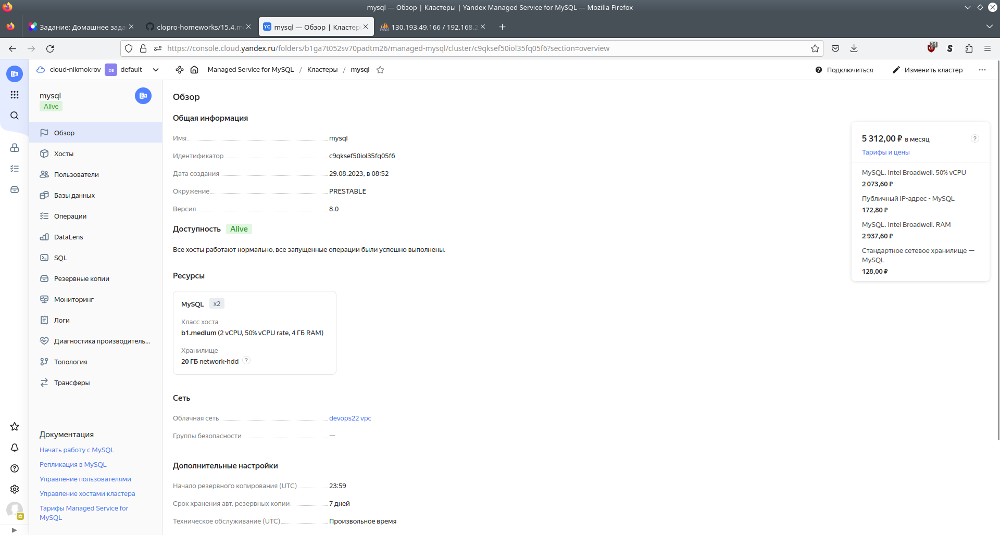
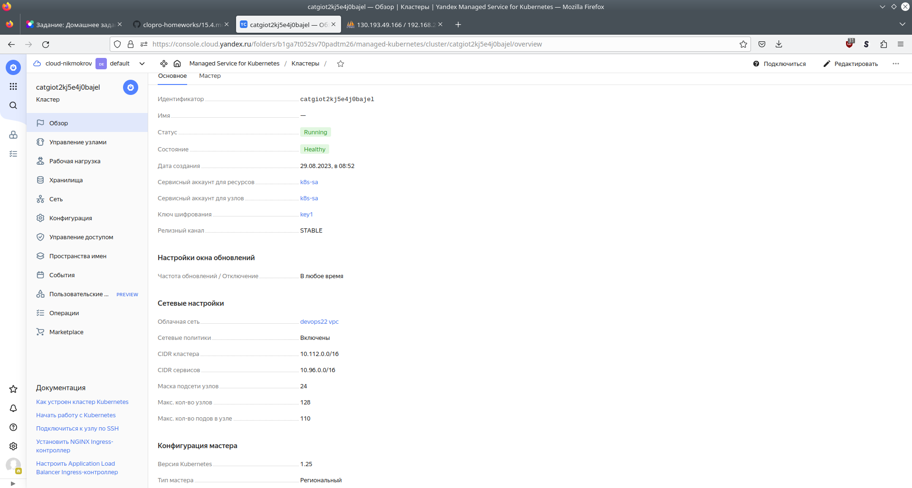
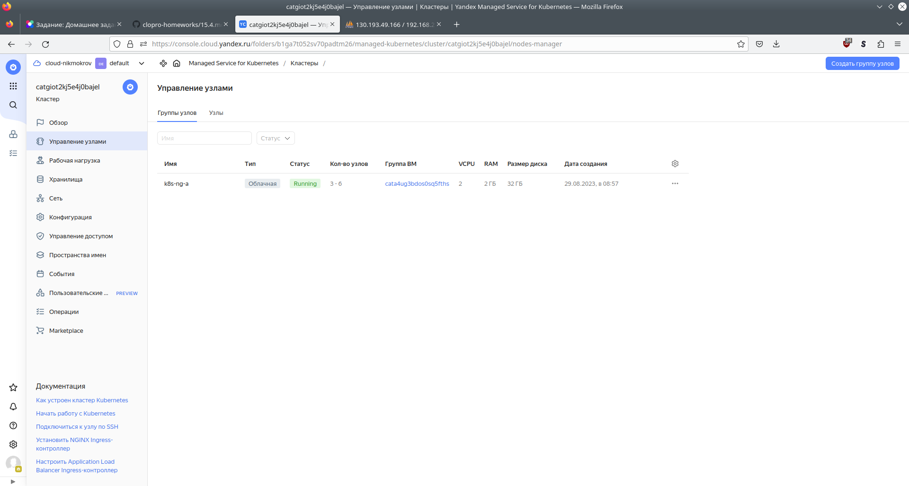
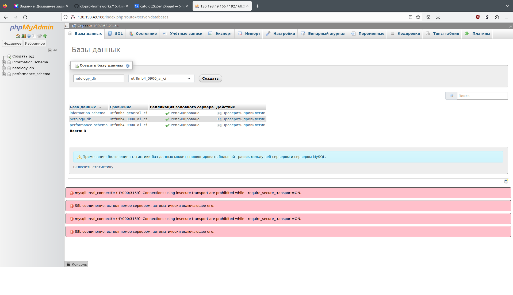

# Домашнее задание к занятию «Кластеры. Ресурсы под управлением облачных провайдеров»

## Задание 1. Yandex Cloud

1. Настроить с помощью Terraform кластер баз данных MySQL</br>
[mysql.tf](./13-cloud/4-cluster/mysql.tf)</br>
[private.tf](./13-cloud/4-cluster/private.tf) - private подсети для MySQL</br>





2.  Настроить с помощью Terraform кластер Kubernetes</br>

[k8s.tf](./13-cloud/4-cluster/k8s.tf)</br>
[node_group.tf](./13-cloud/4-cluster/node_group.tf)</br>
[public.tf](./13-cloud/4-cluster/public.tf) - public подсети для k8s</br>
[sa.tf](./13-cloud/4-cluster/sa.tf) - Service account</br>
[kms.tf](./13-cloud/4-cluster/kms.tf) - KMS</br>
[output.tf](./13-cloud/4-cluster/output.tf) - генерация config для kubectl</br>
[phpmyadmin.yml](./13-cloud/4-cluster/phpmyadmin.yml) - манифест приложения phpmyadmin</br>

Прочие ресурсы Terraform</br>
[main.tf](./13-cloud/4-cluster/main.tf) - провайдер</br>
[vars.tf](./13-cloud/4-cluster/vars.tf) - общие переменные</br>
[vpc.tf](./13-cloud/4-cluster/vpc.tf) - VPC</br>

```console
user@host:~/Netology/DEVOPS-22/devops-netology/13-cloud/4-cluster$ kubectl get nodes
NAME                        STATUS   ROLES    AGE     VERSION
cl1batd0uapq6mlhmh8u-otus   Ready    <none>   5m9s    v1.25.4
cl1batd0uapq6mlhmh8u-yfeb   Ready    <none>   5m8s    v1.25.4
cl1batd0uapq6mlhmh8u-ytoq   Ready    <none>   5m12s   v1.25.4

user@host:~/Netology/DEVOPS-22/devops-netology/13-cloud/4-cluster$ kubectl apply -f phpmyadmin.yml 
deployment.apps/phpmyadmin-deploy created
service/phpmyadmin-svc created

user@host:~/Netology/DEVOPS-22/devops-netology/13-cloud/4-cluster$ kubectl get pods
NAME                                 READY   STATUS    RESTARTS   AGE
phpmyadmin-deploy-6595d4d4fb-88bjj   1/1     Running   0          35s

user@host:~/Netology/DEVOPS-22/devops-netology/13-cloud/4-cluster$ kubectl get svc
NAME             TYPE           CLUSTER-IP     EXTERNAL-IP      PORT(S)        AGE
kubernetes       ClusterIP      10.96.128.1    <none>           443/TCP        9m54s
phpmyadmin-svc   LoadBalancer   10.96.226.79   130.193.49.166   80:31566/TCP   45s

```




