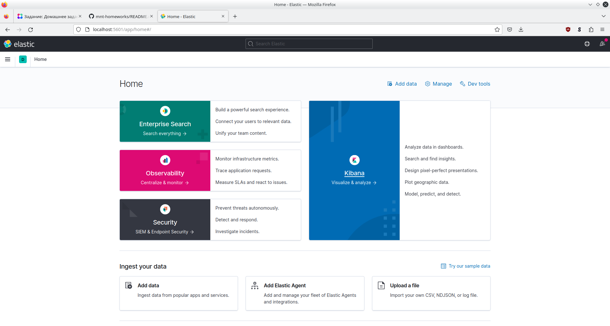
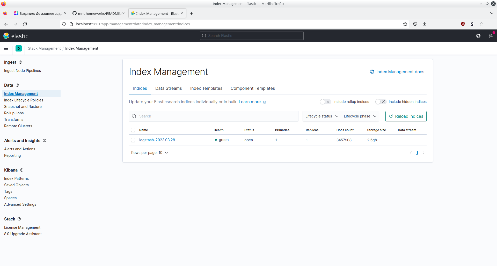
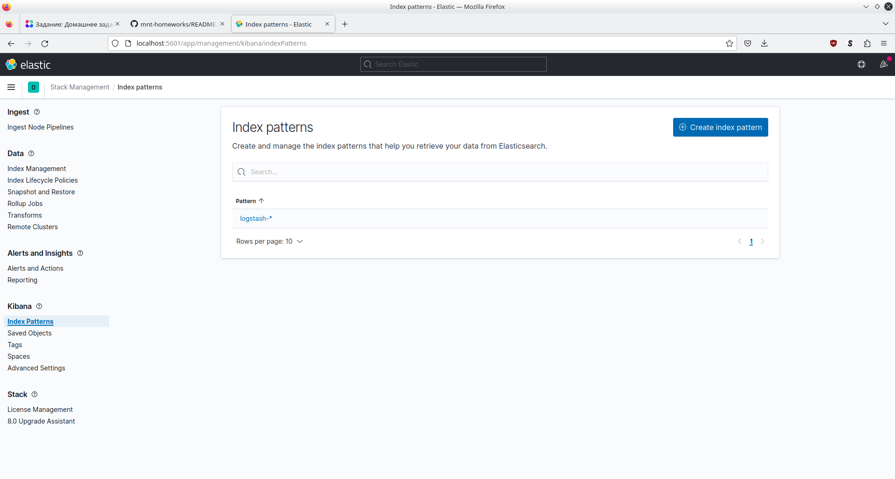
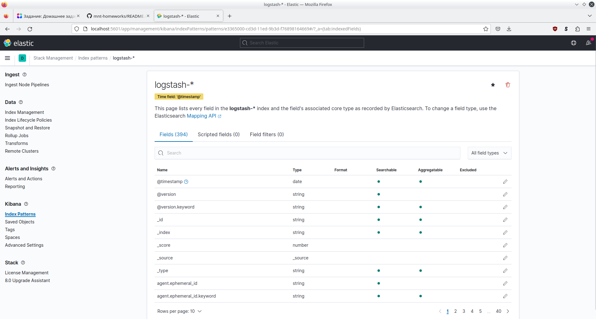
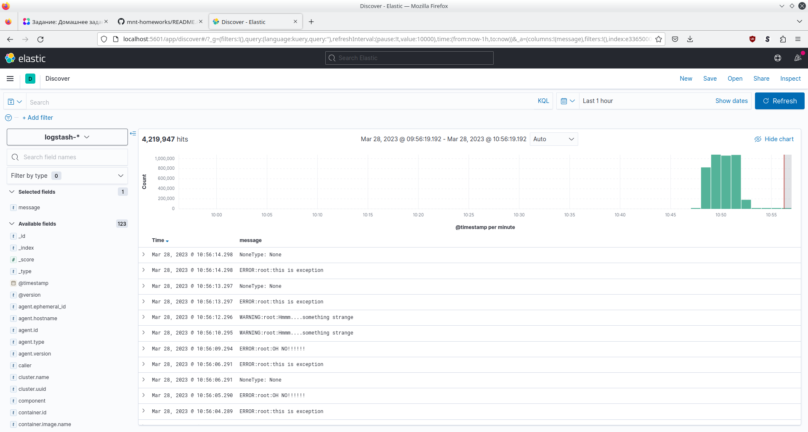
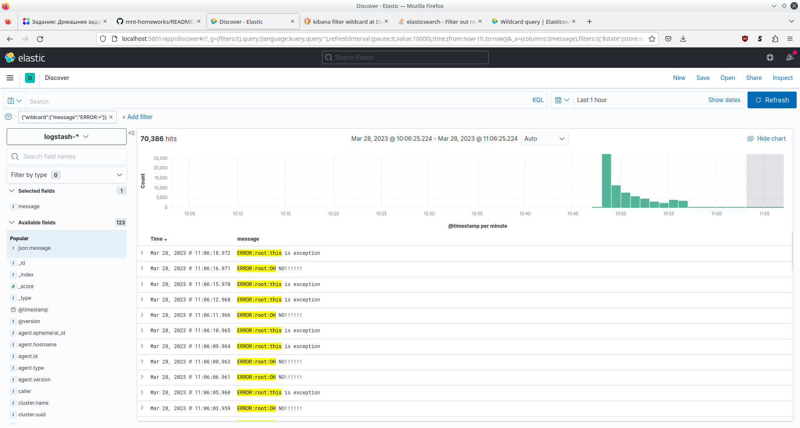

# Домашнее задание к занятию 15 «Система сбора логов Elastic Stack»
## Задание 1

```console
user@host:~/Netology/DEVOPS-22/devops-netology/10-monitoring/04-elk$ docker-compose up -d
Creating network "04-elk_elastic" with driver "bridge"
Creating network "04-elk_default" with the default driver
Creating volume "04-elk_data01" with local driver
Creating volume "04-elk_data02" with local driver
Creating some_app ... done
Creating es-warm  ... done
Creating es-hot   ... done
Creating kibana   ... done
Creating logstash ... done
Creating filebeat ... done

user@host:~/Netology/DEVOPS-22/devops-netology/10-monitoring/04-elk$ docker ps
CONTAINER ID   IMAGE                                                  COMMAND                  CREATED         STATUS         PORTS                                                                                  NAMES
b8f82ddd362d   docker.elastic.co/beats/filebeat:7.2.0                 "/usr/local/bin/dock…"   5 minutes ago   Up 5 minutes                                                                                          filebeat
feca8ae258d7   docker.elastic.co/kibana/kibana:7.11.0                 "/bin/tini -- /usr/l…"   5 minutes ago   Up 5 minutes   0.0.0.0:5601->5601/tcp, :::5601->5601/tcp                                              kibana
636b83ea5914   docker.elastic.co/logstash/logstash:6.3.2              "/usr/local/bin/dock…"   5 minutes ago   Up 5 minutes   5044/tcp, 9600/tcp                                                                     logstash
da2586b7819e   docker.elastic.co/elasticsearch/elasticsearch:7.11.0   "/bin/tini -- /usr/l…"   5 minutes ago   Up 5 minutes   0.0.0.0:9200->9200/tcp, :::9200->9200/tcp, 9300/tcp                                    es-hot
374458da5a6a   docker.elastic.co/elasticsearch/elasticsearch:7.11.0   "/bin/tini -- /usr/l…"   5 minutes ago   Up 5 minutes   9200/tcp, 9300/tcp                                                                     es-warm
207b3e0b4b0f   python:3.9-alpine                                      "python3 /opt/run.py"    5 minutes ago   Up 5 minutes                                                                                          some_app

```



[docker-compose.yml](10-monitoring/04-elk/docker-compose.yml)</br>
[logstash.yml](10-monitoring/04-elk/configs/logstash.yml)</br>
[logstash.conf](10-monitoring/04-elk/configs/logstash.conf)</br>
[filebeat.yml](10-monitoring/04-elk/configs/filebeat.yml)</br>
</br>
</br>
</br>

## Задание 2






