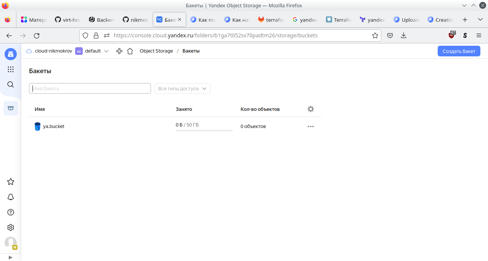

# Домашнее задание к занятию "7.3. Основы и принцип работы Терраформ"
## Задача 1
[versions.tf](07-terraform/versions_from_7_3.tf)</br>



## Задача 2
[main.tf](07-terraform/main_from_7_3.tf)</br>
_Примечание:_ У Яндекса в Compute Cloud не нашел _instance_type_, поэтому просто задаю
разное количество ядер и памяти для stage и prod.
```console
user@host:~$ terraform workspace list
  default
* prod
  stage


user@host:~$ terraform plan

Terraform used the selected providers to generate the following execution plan. Resource actions are indicated with the following symbols:
  + create

Terraform will perform the following actions:

  # yandex_compute_instance.another-test["1"] will be created
  + resource "yandex_compute_instance" "another-test" {
      + allow_stopping_for_update = true
      + created_at                = (known after apply)
      + description               = "another-test-1"
      + folder_id                 = (known after apply)
      + fqdn                      = (known after apply)
      + hostname                  = "another-test-1.nikmokrov.cloud"
      + id                        = (known after apply)
      + name                      = "another-test-1"
      + network_acceleration_type = "standard"
      + platform_id               = "standard-v2"
      + service_account_id        = (known after apply)
      + status                    = (known after apply)
      + zone                      = "ru-central1-b"

      + boot_disk {
          + auto_delete = true
          + device_name = (known after apply)
          + disk_id     = (known after apply)
          + mode        = (known after apply)

          + initialize_params {
              + block_size  = (known after apply)
              + description = (known after apply)
              + image_id    = "fd864gbboths76r8gm5f"
              + name        = "root-another-test-1"
              + size        = 32
              + snapshot_id = (known after apply)
              + type        = "network-ssd"
            }
        }

      + network_interface {
          + index              = (known after apply)
          + ip_address         = (known after apply)
          + ipv4               = true
          + ipv6               = (known after apply)
          + ipv6_address       = (known after apply)
          + mac_address        = (known after apply)
          + nat                = true
          + nat_ip_address     = (known after apply)
          + nat_ip_version     = (known after apply)
          + security_group_ids = (known after apply)
          + subnet_id          = "e2loqdquk6b6btrpu62j"
        }

      + placement_policy {
          + host_affinity_rules = (known after apply)
          + placement_group_id  = (known after apply)
        }

      + resources {
          + core_fraction = 100
          + cores         = 4
          + memory        = 8
        }

      + scheduling_policy {
          + preemptible = true
        }
    }

  # yandex_compute_instance.another-test["2"] will be created
  + resource "yandex_compute_instance" "another-test" {
      + allow_stopping_for_update = true
      + created_at                = (known after apply)
      + description               = "another-test-2"
      + folder_id                 = (known after apply)
      + fqdn                      = (known after apply)
      + hostname                  = "another-test-2.nikmokrov.cloud"
      + id                        = (known after apply)
      + name                      = "another-test-2"
      + network_acceleration_type = "standard"
      + platform_id               = "standard-v2"
      + service_account_id        = (known after apply)
      + status                    = (known after apply)
      + zone                      = "ru-central1-b"

      + boot_disk {
          + auto_delete = true
          + device_name = (known after apply)
          + disk_id     = (known after apply)
          + mode        = (known after apply)

          + initialize_params {
              + block_size  = (known after apply)
              + description = (known after apply)
              + image_id    = "fd864gbboths76r8gm5f"
              + name        = "root-another-test-2"
              + size        = 32
              + snapshot_id = (known after apply)
              + type        = "network-ssd"
            }
        }

      + network_interface {
          + index              = (known after apply)
          + ip_address         = (known after apply)
          + ipv4               = true
          + ipv6               = (known after apply)
          + ipv6_address       = (known after apply)
          + mac_address        = (known after apply)
          + nat                = true
          + nat_ip_address     = (known after apply)
          + nat_ip_version     = (known after apply)
          + security_group_ids = (known after apply)
          + subnet_id          = "e2loqdquk6b6btrpu62j"
        }

      + placement_policy {
          + host_affinity_rules = (known after apply)
          + placement_group_id  = (known after apply)
        }

      + resources {
          + core_fraction = 100
          + cores         = 4
          + memory        = 8
        }

      + scheduling_policy {
          + preemptible = true
        }
    }

  # yandex_compute_instance.test[0] will be created
  + resource "yandex_compute_instance" "test" {
      + allow_stopping_for_update = true
      + created_at                = (known after apply)
      + description               = "test-1"
      + folder_id                 = (known after apply)
      + fqdn                      = (known after apply)
      + hostname                  = "test-1.nikmokrov.cloud"
      + id                        = (known after apply)
      + name                      = "test-1"
      + network_acceleration_type = "standard"
      + platform_id               = "standard-v2"
      + service_account_id        = (known after apply)
      + status                    = (known after apply)
      + zone                      = "ru-central1-b"

      + boot_disk {
          + auto_delete = true
          + device_name = (known after apply)
          + disk_id     = (known after apply)
          + mode        = (known after apply)

          + initialize_params {
              + block_size  = (known after apply)
              + description = (known after apply)
              + image_id    = "fd864gbboths76r8gm5f"
              + name        = "root-test-1"
              + size        = 32
              + snapshot_id = (known after apply)
              + type        = "network-ssd"
            }
        }

      + network_interface {
          + index              = (known after apply)
          + ip_address         = (known after apply)
          + ipv4               = true
          + ipv6               = (known after apply)
          + ipv6_address       = (known after apply)
          + mac_address        = (known after apply)
          + nat                = true
          + nat_ip_address     = (known after apply)
          + nat_ip_version     = (known after apply)
          + security_group_ids = (known after apply)
          + subnet_id          = "e2loqdquk6b6btrpu62j"
        }

      + placement_policy {
          + host_affinity_rules = (known after apply)
          + placement_group_id  = (known after apply)
        }

      + resources {
          + core_fraction = 100
          + cores         = 4
          + memory        = 8
        }

      + scheduling_policy {
          + preemptible = true
        }
    }

  # yandex_compute_instance.test[1] will be created
  + resource "yandex_compute_instance" "test" {
      + allow_stopping_for_update = true
      + created_at                = (known after apply)
      + description               = "test-2"
      + folder_id                 = (known after apply)
      + fqdn                      = (known after apply)
      + hostname                  = "test-2.nikmokrov.cloud"
      + id                        = (known after apply)
      + name                      = "test-2"
      + network_acceleration_type = "standard"
      + platform_id               = "standard-v2"
      + service_account_id        = (known after apply)
      + status                    = (known after apply)
      + zone                      = "ru-central1-b"

      + boot_disk {
          + auto_delete = true
          + device_name = (known after apply)
          + disk_id     = (known after apply)
          + mode        = (known after apply)

          + initialize_params {
              + block_size  = (known after apply)
              + description = (known after apply)
              + image_id    = "fd864gbboths76r8gm5f"
              + name        = "root-test-2"
              + size        = 32
              + snapshot_id = (known after apply)
              + type        = "network-ssd"
            }
        }

      + network_interface {
          + index              = (known after apply)
          + ip_address         = (known after apply)
          + ipv4               = true
          + ipv6               = (known after apply)
          + ipv6_address       = (known after apply)
          + mac_address        = (known after apply)
          + nat                = true
          + nat_ip_address     = (known after apply)
          + nat_ip_version     = (known after apply)
          + security_group_ids = (known after apply)
          + subnet_id          = "e2loqdquk6b6btrpu62j"
        }

      + placement_policy {
          + host_affinity_rules = (known after apply)
          + placement_group_id  = (known after apply)
        }

      + resources {
          + core_fraction = 100
          + cores         = 4
          + memory        = 8
        }

      + scheduling_policy {
          + preemptible = true
        }
    }

Plan: 4 to add, 0 to change, 0 to destroy.

Changes to Outputs:
  + external_ip_address_another_test_yandex_cloud = [
      + (known after apply),
      + (known after apply),
    ]
  + external_ip_address_test_yandex_cloud         = [
      + (known after apply),
      + (known after apply),
    ]
  
```


# Домашнее задание к занятию "7.4. Средства командной работы над инфраструктурой"
## Задача 1


## Задача 2

[server.yaml](07-terraform/server.yaml)</br>
[atlantis.yaml](07-terraform/atlantis.yaml)</br>

## Задача 3
Для создания инстансов в Yandex Cloud использовал следующий модуль:
(https://github.com/glavk/terraform-yandex-compute)

[versions.tf](07-terraform/versions.tf)</br>
[main.tf](07-terraform/main.tf)</br>


# Домашнее задание к занятию "7.5. Основы golang"
## Задача 3. Написание кода.
[task1.go](07-terraform/go/task1/task1.go)</br>
```go
package main

import "fmt"

func Convert(foot float64) float64 {
	return foot / 0.3048
}

func main() {
	fmt.Print("Введите метры: ")
	var input float64
	_, err := fmt.Scanf("%f", &input)
	if err != nil {
		panic("Это не число!")
	}
	output := Convert(input)
	fmt.Print("Получите футы: ")
	fmt.Println(output)
}
```
[task2.go](07-terraform/go/task2/task2.go)</br>
```go
package main

import "fmt"

func main() {

	x := []int{48, 96, 86, 68, 57, 82, 63, 70, 37, 34, 83, 27, 19, 97, 9, 17}
	min := x[0]
	for _, value := range x {
		if value < min {
			min = value
		}
	}
	fmt.Println("Min:", min)
}
```
[task3.go](07-terraform/go/task3/task3.go)</br>
```go
package main

import "fmt"

func main() {

	for i := 1; i <= 100; i++ {
		if i % 3 == 0 {
			fmt.Print(" ", i)
		}
	}
	fmt.Println()
}
```

## Задача 4. Протестировать код.
[task1_test.go](07-terraform/go/task1/task1_test.go)</br>
```go
package main

import "testing"

func TestConvert(t *testing.T) {
	var v float64
	v = Convert(12)
	if v != 39.37007874015748 {
		t.Error("Expected 39.37007874015748, got ", v)
	}
}
```

[task2_test.go](07-terraform/go/task2/task2_test.go)</br>
```go
package main

import (
	"fmt"
	"os/exec"
	"strings"
	"testing"
)

func TestMain(t *testing.T) {
	var err error
	cmd := exec.Command("./task2")
	out, err := cmd.CombinedOutput()
	sout := string(out)
	if err != nil || !strings.Contains(sout, "Min: 9") {
		fmt.Println(sout)
		t.Errorf("%v", err)
	}
}
```

[task3_test.go](07-terraform/go/task3/task3_test.go)</br>
```go
package main

import (
	"fmt"
	"os/exec"
	"strings"
	"testing"
)

func TestMain(t *testing.T) {
	var err error
	cmd := exec.Command("./task3")
	out, err := cmd.CombinedOutput()
	sout := string(out)
	if err != nil || !strings.Contains(sout, "3 6 9 12 15 18 21 24 27 30 33 36 39 42 45 48 51 54 57 60 63 66 69 72 75 78 81 84 87 90 93 96 99") {
		fmt.Println(sout)
		t.Errorf("%v", err)
	}
}
```
