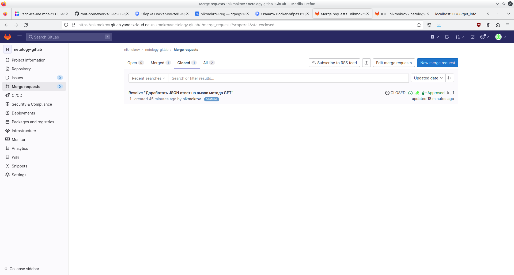
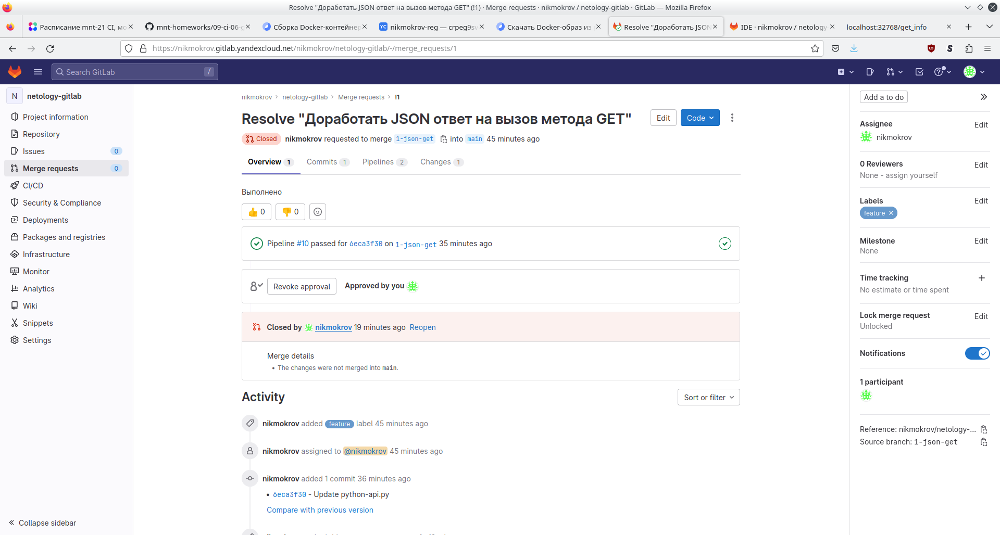
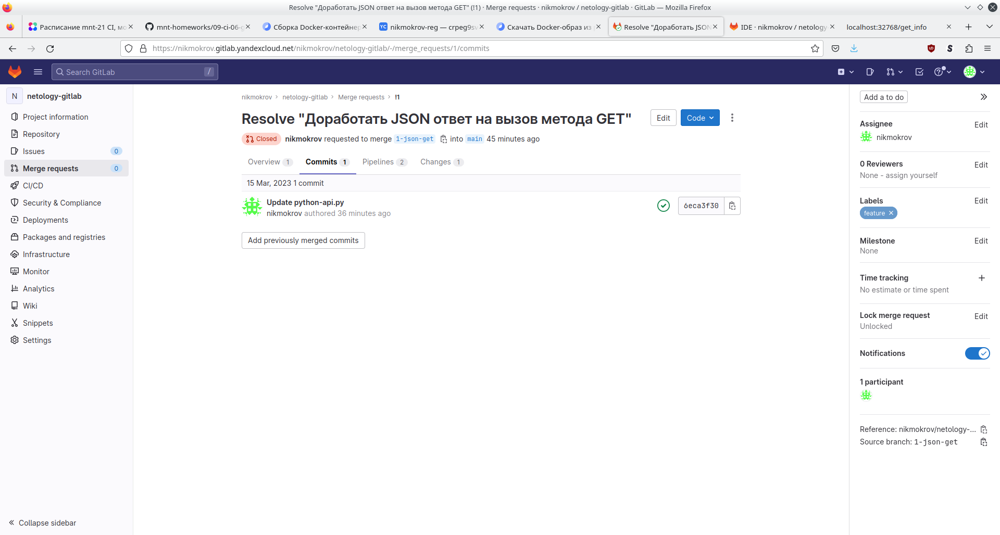
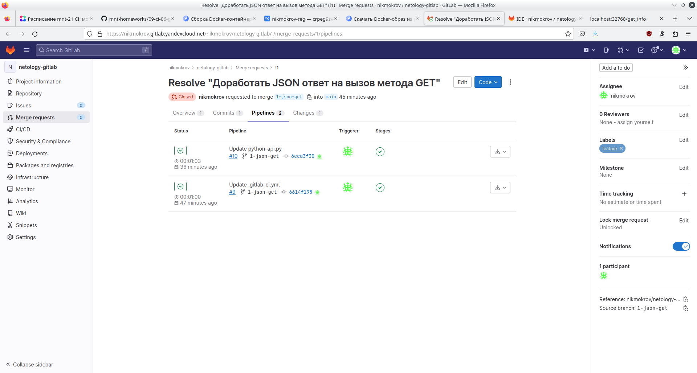
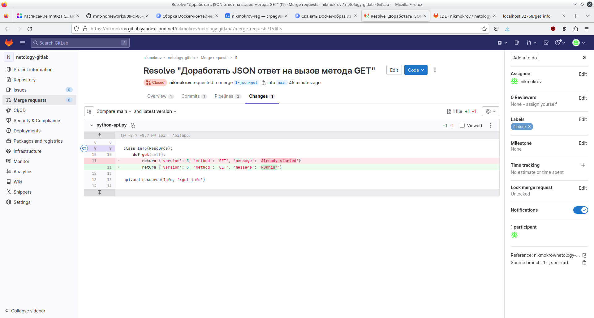
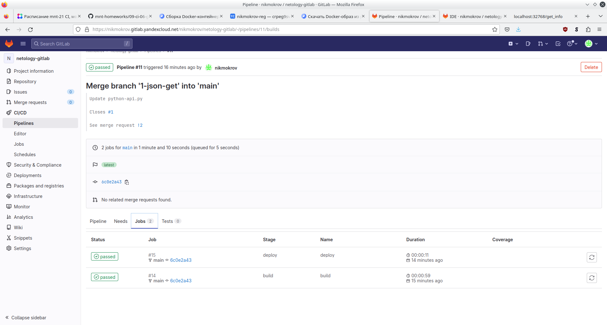
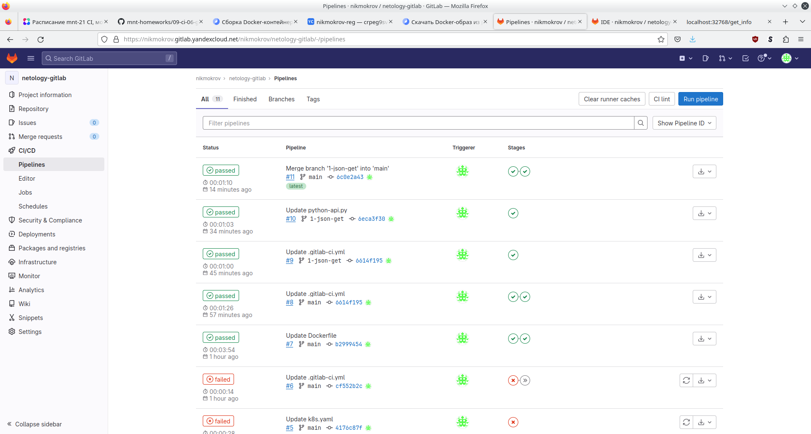
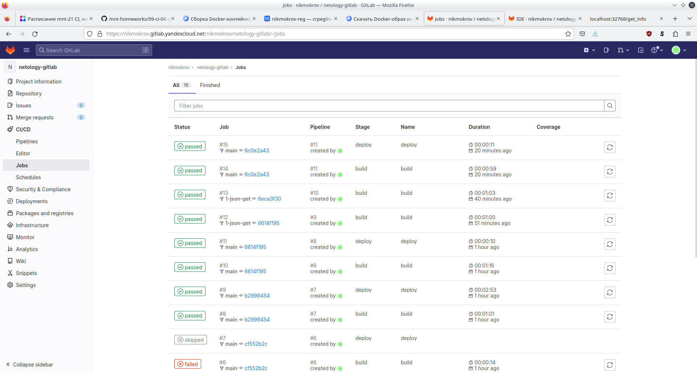
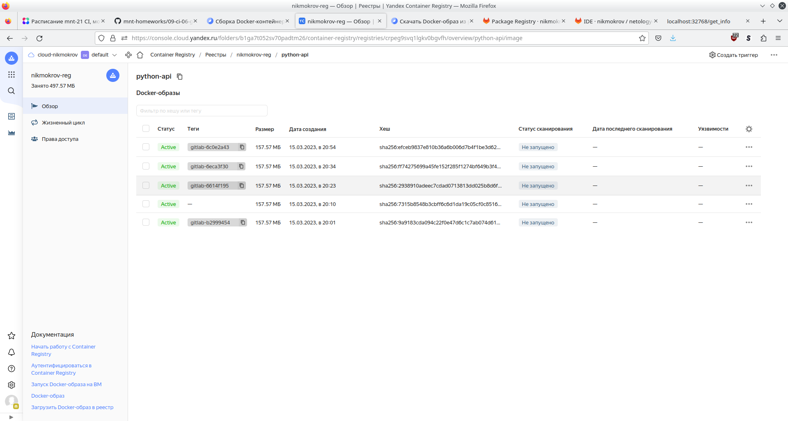
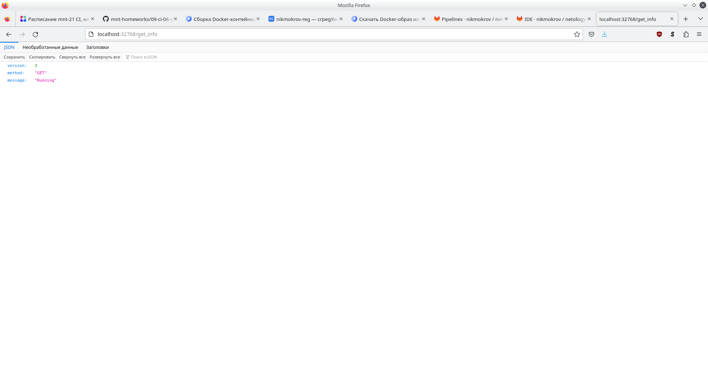

# Домашнее задание к занятию 12 «GitLab»
## Основная часть

### DevOps

[gitlab-ci.yml](09-ci/06-gitlab/netology-gitlab/gitlab-ci.yml)</br>
[Dockerfile](09-ci/06-gitlab/netology-gitlab/Dockerfile4)</br>
[k8s.yaml](09-ci/06-gitlab/netology-gitlab/k8s.yaml)</br>
[python-api.py](09-ci/06-gitlab/netology-gitlab/python-api.py)</br>

### Product Owner



### Developer










### Tester
```console
user@host:~$ docker images
REPOSITORY                                  TAG                  IMAGE ID       CREATED          SIZE
cr.yandex/crpeg9svq1lgkv0bgvfh/python-api   gitlab-6c0e2a43      a35f63b2d184   43 minutes ago   465MB

user@host:~$ docker ps
CONTAINER ID   IMAGE          COMMAND                  CREATED          STATUS          PORTS                                         NAMES
8bcb6e1ee08d   a35f63b2d184   "python3 python-api.…"   33 minutes ago   Up 33 minutes   0.0.0.0:32768->5290/tcp, :::32768->5290/tcp   serene_bouman
```


