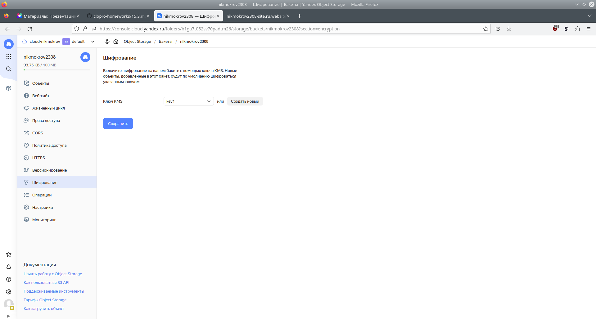
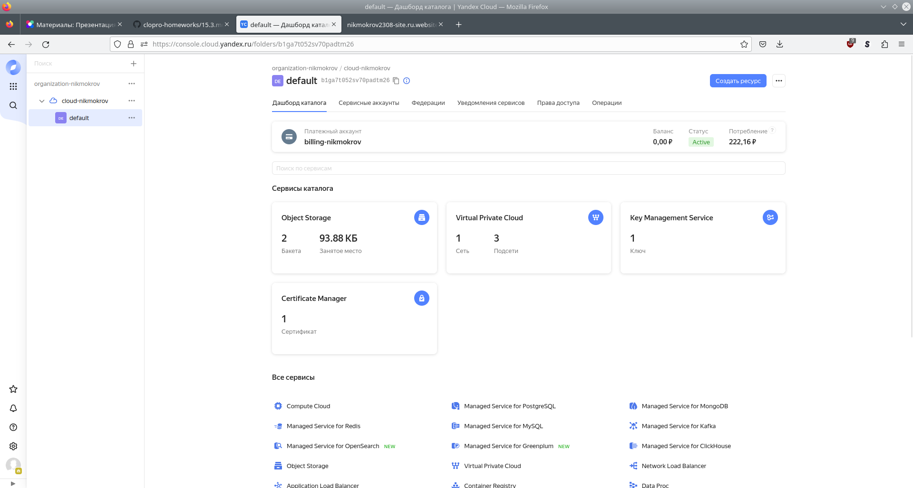
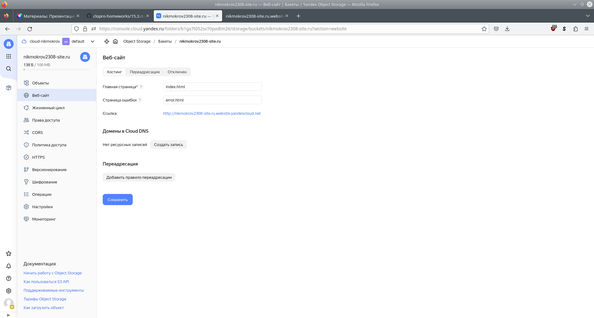
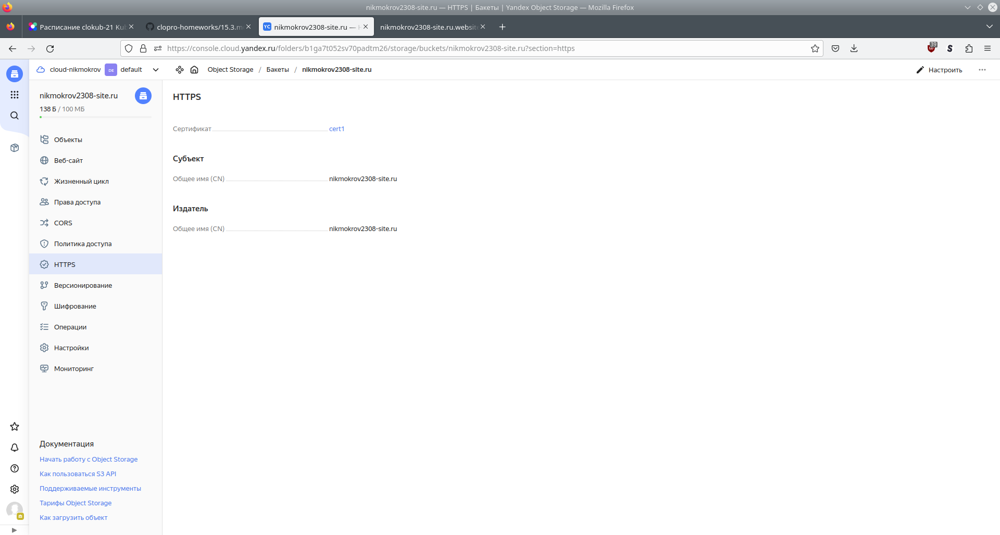
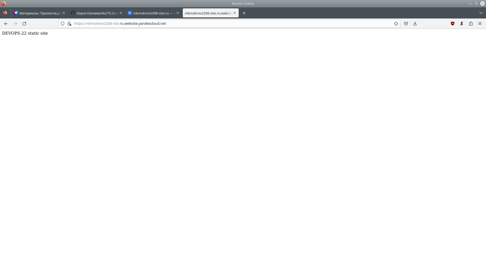

# Домашнее задание к занятию «Безопасность в облачных провайдерах»

## Задание 1. Yandex Cloud

1. С помощью ключа в KMS необходимо зашифровать содержимое бакета</br>
[sa.tf](./13-cloud/3-security/sa.tf)</br>
[bucket.tf](./13-cloud/3-security/bucket.tf)</br>



2.  Создать статический сайт в Object Storage c собственным публичным адресом и сделать доступным по HTTPS</br>
```console
user@host:~/Netology/DEVOPS-22/devops-netology/13-cloud/3-security$ openssl req -x509 -newkey rsa:4096 -nodes \
  -keyout key.pem \
  -out cert.pem \
  -days 90 \
  -subj '/CN=nikmokrov2308-site.ru'
Generating a RSA private key
..................................................++++
..................++++
writing new private key to 'key.pem'
-----

```

[site.tf](./13-cloud/3-security/site.tf)</br>
[index.html](./13-cloud/3-security/index.html)</br>
[error.html](./13-cloud/3-security/error.html)</br>

Прочие ресурсы Terraform</br>
[main.tf](./13-cloud/3-security/main.tf)</br>
[vars.tf](./13-cloud/3-security/vars.tf)</br>

```console
user@host:~$ terraform apply
...
Apply complete! Resources: 9 added, 0 changed, 0 destroyed.
```



```console
user@host:~/Netology/DEVOPS-22/devops-netology/13-cloud/3-security$ yc kms symmetric-key list
+----------------------+------+----------------------+-------------------+---------------------+--------+
|          ID          | NAME |  PRIMARY VERSION ID  | DEFAULT ALGORITHM |     CREATED AT      | STATUS |
+----------------------+------+----------------------+-------------------+---------------------+--------+
| abjt9e5fn9c8kvveinh5 | key1 | abjog0c4aakbuv8ug1ep | AES_256           | 2023-08-23 15:04:14 | ACTIVE |
+----------------------+------+----------------------+-------------------+---------------------+--------+

user@host:~/Netology/DEVOPS-22/devops-netology/13-cloud/3-security$ yc storage bucket list
+-----------------------+----------------------+-----------+-----------------------+---------------------+
|         NAME          |      FOLDER ID       | MAX SIZE  | DEFAULT STORAGE CLASS |     CREATED AT      |
+-----------------------+----------------------+-----------+-----------------------+---------------------+
| nikmokrov2308-site.ru | b1ga7t052sv70padtm26 | 104857600 | STANDARD              | 2023-08-23 15:04:14 |
| nikmokrov2308         | b1ga7t052sv70padtm26 | 104857600 | STANDARD              | 2023-08-23 15:04:14 |
+-----------------------+----------------------+-----------+-----------------------+---------------------+

user@host:~/Netology/DEVOPS-22/devops-netology/13-cloud/3-security$ yc storage bucket get-https nikmokrov2308-site.ru
name: nikmokrov2308-site.ru
source_type: SOURCE_TYPE_MANAGED_BY_CERTIFICATE_MANAGER
certificate_id: fpqjr4hj60eog171tmm0

user@host:~/Netology/DEVOPS-22/devops-netology/13-cloud/3-security$ yc certificate-manager certificate list
+----------------------+-------+-----------------------+---------------------+----------+--------+
|          ID          | NAME  |        DOMAINS        |      NOT AFTER      |   TYPE   | STATUS |
+----------------------+-------+-----------------------+---------------------+----------+--------+
| fpqjr4hj60eog171tmm0 | cert1 | nikmokrov2308-site.ru | 2023-11-21 13:09:34 | IMPORTED | ISSUED |
+----------------------+-------+-----------------------+---------------------+----------+--------+

```



