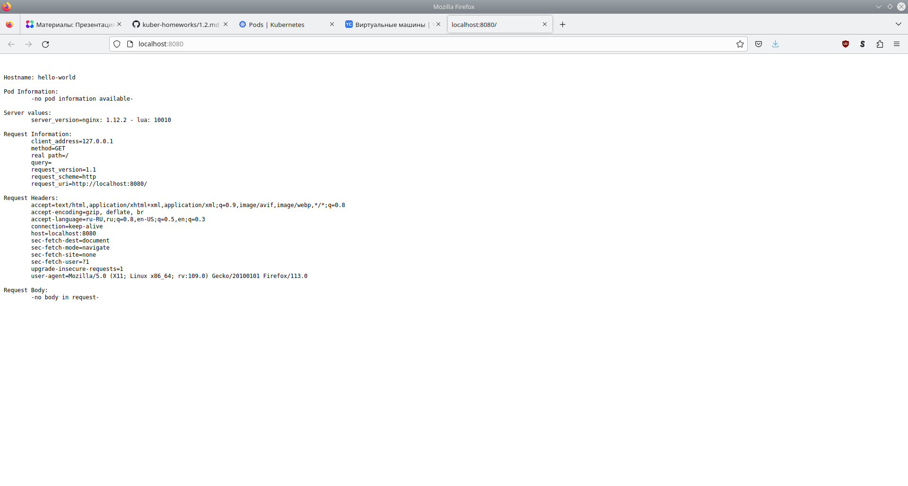

# Домашнее задание к занятию «Базовые объекты K8S»

## Задание 1. Создать Pod с именем hello-world

[Манифест Task1.yml](12-kuber/2-baseobj/task1.yml)

```console
user@host:~$ kubectl apply -f Netology/DEVOPS-22/devops-netology/12-kuber/2-baseobj/task1.yml 
pod/hello-world created

user@host:~$ kubectl get pods
NAME          READY   STATUS    RESTARTS   AGE
hello-world   1/1     Running   0          3s

user@host:~$ kubectl port-forward pod/hello-world 8080:8080

user@host:~$ curl localhost:8080


Hostname: hello-world

Pod Information:
        -no pod information available-

Server values:
        server_version=nginx: 1.12.2 - lua: 10010

Request Information:
        client_address=127.0.0.1
        method=GET
        real path=/
        query=
        request_version=1.1
        request_scheme=http
        request_uri=http://localhost:8080/

Request Headers:
        accept=*/*  
        host=localhost:8080  
        user-agent=curl/7.74.0  

Request Body:
        -no body in request-

```



## Задание 2. Создать Service и подключить его к Pod

[Манифест Task2.yml](12-kuber/2-baseobj/task2.yml)

```console
user@host:~$ kubectl apply -f Netology/DEVOPS-22/devops-netology/12-kuber/2-baseobj/task2.yml 
pod/netology-web created
service/netology-svc created

user@host:~$ kubectl get pods
NAME           READY   STATUS    RESTARTS   AGE
hello-world    1/1     Running   0          13m
netology-web   1/1     Running   0          9s

user@host:~$ kubectl get svc
NAME           TYPE        CLUSTER-IP      EXTERNAL-IP   PORT(S)    AGE
kubernetes     ClusterIP   10.152.183.1    <none>        443/TCP    28m
netology-svc   ClusterIP   10.152.183.77   <none>        8888/TCP   13s

user@host:~$ kubectl describe svc/netology-svc
Name:              netology-svc
Namespace:         default
Labels:            <none>
Annotations:       <none>
Selector:          app=netology-web
Type:              ClusterIP
IP Family Policy:  SingleStack
IP Families:       IPv4
IP:                10.152.183.77
IPs:               10.152.183.77
Port:              netology-web-port  8888/TCP
TargetPort:        8080/TCP
Endpoints:         10.1.128.206:8080
Session Affinity:  None
Events:            <none>

user@host:~$ kubectl port-forward svc/netology-svc 8888:8888

user@host:~$ curl localhost:8888


Hostname: netology-web

Pod Information:
        -no pod information available-

Server values:
        server_version=nginx: 1.12.2 - lua: 10010

Request Information:
        client_address=127.0.0.1
        method=GET
        real path=/
        query=
        request_version=1.1
        request_scheme=http
        request_uri=http://localhost:8080/

Request Headers:
        accept=*/*  
        host=localhost:8888  
        user-agent=curl/7.74.0  

Request Body:
        -no body in request-


```

