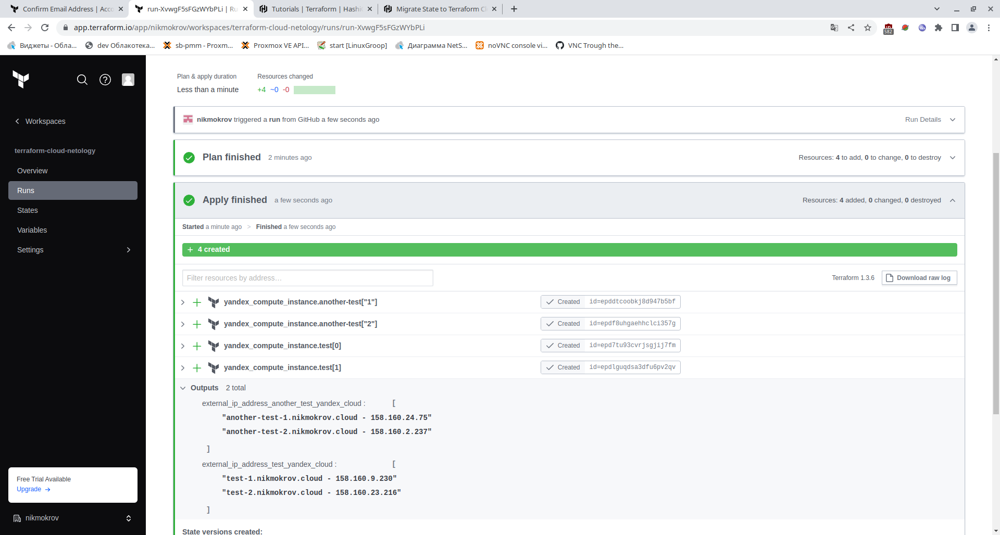

# Домашнее задание к занятию "7.4. Средства командной работы над инфраструктурой"
## Задача 1



## Задача 2

[server.yaml](07-terraform/server.yaml)</br>
[atlantis.yaml](07-terraform/atlantis.yaml)</br>

## Задача 3
Для создания инстансов в Yandex Cloud использовал следующий модуль:
(https://github.com/glavk/terraform-yandex-compute)

[versions.tf](07-terraform/versions.tf)</br>
[main.tf](07-terraform/main.tf)</br>


# Домашнее задание к занятию "7.5. Основы golang"
## Задача 3. Написание кода.
[task1.go](07-terraform/go/task1/task1.go)</br>
```go
package main

import "fmt"

func Convert(foot float64) float64 {
	return foot / 0.3048
}

func main() {
	fmt.Print("Введите метры: ")
	var input float64
	_, err := fmt.Scanf("%f", &input)
	if err != nil {
		panic("Это не число!")
	}
	output := Convert(input)
	fmt.Print("Получите футы: ")
	fmt.Println(output)
}
```
[task2.go](07-terraform/go/task2/task2.go)</br>
```go
package main

import "fmt"

func main() {

	x := []int{48, 96, 86, 68, 57, 82, 63, 70, 37, 34, 83, 27, 19, 97, 9, 17}
	min := x[0]
	for _, value := range x {
		if value < min {
			min = value
		}
	}
	fmt.Println("Min:", min)
}
```
[task3.go](07-terraform/go/task3/task3.go)</br>
```go
package main

import "fmt"

func main() {

	for i := 1; i <= 100; i++ {
		if i % 3 == 0 {
			fmt.Print(" ", i)
		}
	}
	fmt.Println()
}
```

## Задача 4. Протестировать код.
[task1_test.go](07-terraform/go/task1/task1_test.go)</br>
```go
package main

import "testing"

func TestConvert(t *testing.T) {
	var v float64
	v = Convert(12)
	if v != 39.37007874015748 {
		t.Error("Expected 39.37007874015748, got ", v)
	}
}
```

[task2_test.go](07-terraform/go/task2/task2_test.go)</br>
```go
package main

import (
	"fmt"
	"os/exec"
	"strings"
	"testing"
)

func TestMain(t *testing.T) {
	var err error
	cmd := exec.Command("./task2")
	out, err := cmd.CombinedOutput()
	sout := string(out)
	if err != nil || !strings.Contains(sout, "Min: 9") {
		fmt.Println(sout)
		t.Errorf("%v", err)
	}
}
```

[task3_test.go](07-terraform/go/task3/task3_test.go)</br>
```go
package main

import (
	"fmt"
	"os/exec"
	"strings"
	"testing"
)

func TestMain(t *testing.T) {
	var err error
	cmd := exec.Command("./task3")
	out, err := cmd.CombinedOutput()
	sout := string(out)
	if err != nil || !strings.Contains(sout, "3 6 9 12 15 18 21 24 27 30 33 36 39 42 45 48 51 54 57 60 63 66 69 72 75 78 81 84 87 90 93 96 99") {
		fmt.Println(sout)
		t.Errorf("%v", err)
	}
}
```
