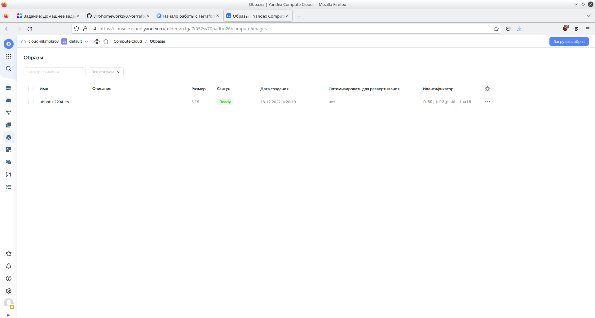
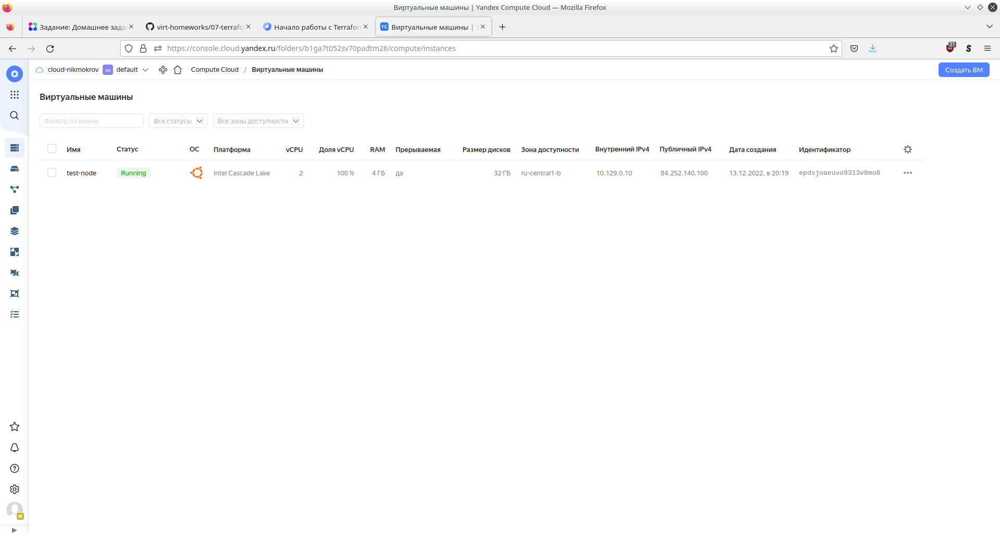

# Домашнее задание к занятию "7.1. Инфраструктура как код"
## Задача 1

1. Какой тип инфраструктуры будем использовать для этого проекта: изменяемый или не изменяемый?</br>
С учетом того, что техническое задание еще не четкое, а клиент пока один, лучше выбрать 
изменяемую инфраструктуру. Это более гибкий вариант, который проще подготовить к большому 
количеству небольших релизов, тестирований интеграций, откатов, доработок. Для одного клиента в 
первое время не нужно готовить большое количество образов, гораздо важнее скорость 
применения изменений конфигураций. 
2. Будет ли центральный сервер для управления инфраструктурой?</br>
Вопрос зависит от сложившейся культуры взаимодействия разработчиков и позиции руководства
по вопросу безопасности хранения конфигураций инфраструктуры. Но раз работу нужно начать немедленно,
разработчики уже немного знают Ansible и неплохо Terraform, начать следует без центрального сервера.
Это позволит сразу приступить к работе, не тратя время на планирование и развертывание центрального
сервера, разработки регламентов работы с ним и прочую "бюрократию". 
При необходимости сервер всегда можно создать позднее.
3. Будут ли агенты на серверах?</br>
Так как решили использовать изменяемую инфраструктуру, не готовить образы, а также сделать упор 
на Ansible (стандарт de-facto индустрии) и разработчики уже немного его знают, значит без агентов. 
Это также немного ускорит развертывание сервисов.
4. Будут ли использованы средства для управления конфигурацией или инициализации ресурсов?</br>
Это зависит от наличия и размещения ресурсов. Если в облаке (а это самый быстрый для развертывания
вариант), то разумеется используем Terraform (тем более год назад его начали активно использовать).
Если облако по каким-то причинам не подходит и используем собственное "голое железо", под которое нет 
провайдеров Terraform, можно обойтись Ansible.
5. Какие инструменты из уже используемых вы хотели бы использовать для нового проекта? </br>
Terraform, Ansible, Kubernetes, позднее при необходимости Packer.
6. Хотите ли рассмотреть возможность внедрения новых инструментов для этого проекта? </br>
Ничего не сказано про СКВ, а ее обязательно нужно использовать: Github или Gitlab отлично подойдут.

На совещании обязательно нужно уточнить:
- Где будут размещаться ресурсы: в облаке или на baremetal;
- Позицию руководства по вопросу безопасности (как хранить конфигурацию, на сервере или распределенно)


## Задача 2
```console
user@host:~$ terraform --version
Terraform v1.3.4
on linux_amd64
```

## Задача 3
```console
user@host:~$ terraform --version
Terraform v1.3.4
on linux_amd64

user@host:~/Netology/DEVOPS-22/tools/terraform-0.15.5$ ./terraform --version
Terraform v0.15.5
on linux_amd64

```


# Домашнее задание к занятию "7.2. Облачные провайдеры и синтаксис Terraform."
## Задача 1
```console
user@host:~$ yc config list
token: y0_token_was_here
cloud-id: b1gcn03m319mu8kiic9q
folder-id: b1ga7t052sv70padtm26
compute-default-zone: ru-central1-b
```

## Задача 2
1. Cоздать свой образ ami (или yandex) можно при помощи Packer
2. 
[main.tf](07-terraform/main.tf)</br>
[versions.tf](07-terraform/versions.tf)</br>



