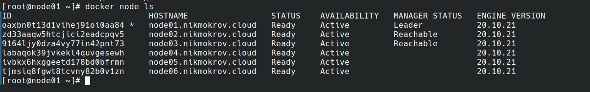
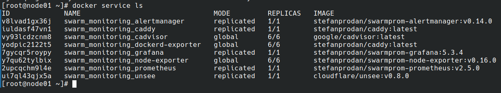
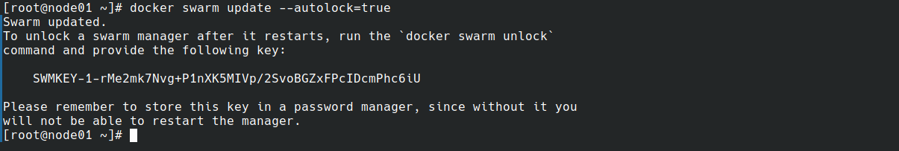
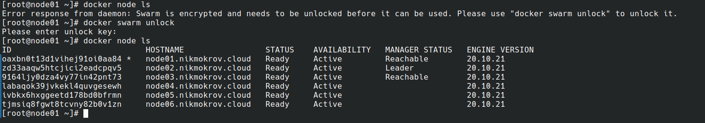

### Домашнее задание к занятию "5. Оркестрация кластером Docker контейнеров на примере Docker Swarm"
### Задача 1
- В чём отличие режимов работы сервисов в Docker Swarm кластере: replication и global? 
В режиме replication мы сами задаем количество заданий (tasks) в рамках одного сервиса и 
будет создано соответствующее количество реплик, которые будут распределены по нодам. При
изменении количества нод количество реплик не изменится.
Сервис в режиме global имеет по одному заданию (task) на каждой ноде в кластере, при этом,
если в кластер добавится нода, на ней автоматически запустится еще одно задание сервиса.
Типичные примеры global сервиса - это мониторинг-агенты и антивирусные сканеры.
- Какой алгоритм выбора лидера используется в Docker Swarm кластере? 
Используется Raft Consensus Algorithm, гарантирующий, что все управляющие ноды в кластере
будут находиться в согласованном состоянии, а также обеспечивающий надежный выбор лидера
кластера.
- Что такое Overlay Network? 
Это распределенная сеть, создаваемая поверх собственных сетей хостов кластера 
и использующаяся для безопасного (если включено шифрование) обмена данными между 
контейнерами в кластере и самими нодами. Docker обеспечивает прозрачную пакетную 
маршрутизацию внутри такой сети. При инициализации кластера создается как минимум 
одна overlay сеть (она называется ingress) и все новые службы по-умолчанию подключаются 
к ней, если им не задана иная сеть.

### Задача 2

### Задача 3

### Задача 4

после рестарта ноды

Команда _docker swarm update --autolock=true_ включает режим блокировки кластера. Этот
режим означает, что после рестарта менеджера кластера для управления кластером менеджер
нужно разблокировать вручную, предоставив соответствующий токен, с помощью команды
_docker swarm unlock_. При этом, если токен изменился, когда менеджер был выключен или
недоступен по сети, его придется выводить из кластера и вводить вновь.
Режим был введен для защиты от перехвата TLS ключей, использующихся для шифрования данных,
хранящихся на дисках и передающихся по сети. Токен разблокировки рекомендуется
регулярно менять с помощью команды _docker swarm unlock-key --rotate_.
