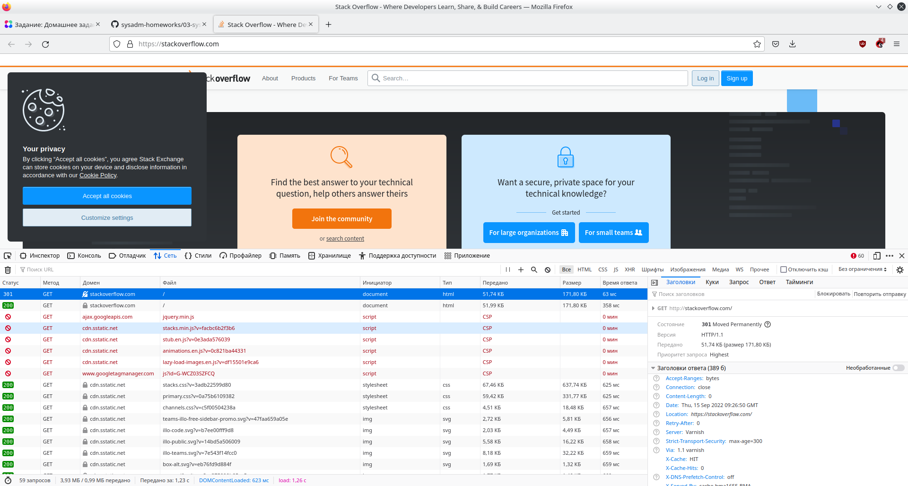
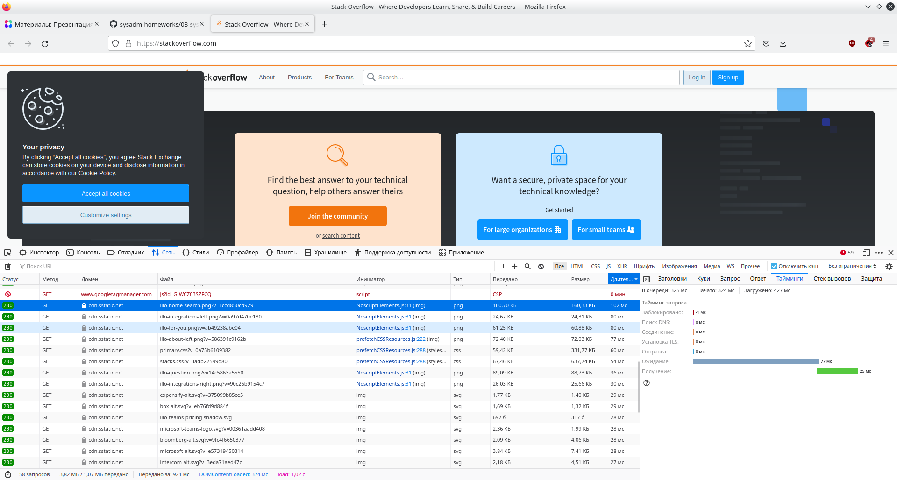
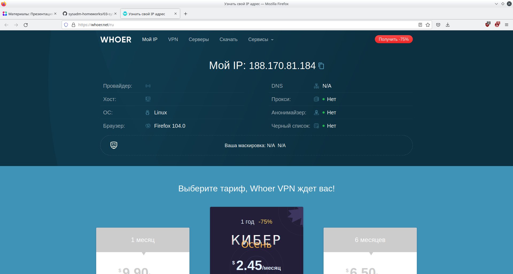

# Ответы на задание к занятию "3.6. Компьютерные сети, лекция 1"
1.
```console
vagrant@vagrant:~$ telnet stackoverflow.com 80
Trying 151.101.193.69...
Connected to stackoverflow.com.
Escape character is '^]'.
GET /questions HTTP/1.0
HOST: stackoverflow.com

HTTP/1.1 301 Moved Permanently
Server: Varnish
Retry-After: 0
Location: https://stackoverflow.com/questions
Content-Length: 0
Accept-Ranges: bytes
Date: Thu, 15 Sep 2022 09:07:30 GMT
Via: 1.1 varnish
Connection: close
X-Served-By: cache-bma1663-BMA
X-Cache: HIT
X-Cache-Hits: 0
X-Timer: S1663232851.872564,VS0,VE0
Strict-Transport-Security: max-age=300
X-DNS-Prefetch-Control: off

Connection closed by foreign host.
```
Ответный код - 301 Moved Permanently. Код означает, что запрошенная страница была навсегда перемещена и имеет другой URI, который указан в поле Location. В нашем случае - Location: https://stackoverflow.com/questions, т.е. страница доступна теперь только по протоколу https.

2.


Ответ тот же - 301. Дольше всего (102 мс) обрабатывался GET запрос на загрузку файла illo-search-home.png c CDN (cdn.sstatic.net)


3.

или
```console
vagrant@vagrant:~$ curl ifconfig.me
188.170.81.184
```

4.
```console
vagrant@vagrant:~$ whois 188.170.81.184  

inetnum:        188.170.80.0 - 188.170.95.255
netname:        MF-NORD-WEST-PS
country:        RU
admin-c:        MA23317-RIPE
tech-c:         MWST-RIPE
status:         ASSIGNED PA
mnt-by:         GDC-TR-CoreIP
created:        2022-08-11T14:20:11Z
last-modified:  2022-08-11T14:20:11Z
source:         RIPE

role:           Mobile
address:        Samara
nic-hdl:        MA23317-RIPE
mnt-by:         GDC-TR-CoreIP
created:        2020-02-05T11:44:29Z
last-modified:  2020-02-05T11:44:29Z
source:         RIPE # Filtered

role:           MegaFon PJSC - GNOC West TRM IP
address:        PJSC "MegaFon"
address:        41, Oruzheyniy lane
address:        Moscow, 127006
abuse-mailbox:  abuse-mailbox@megafon.ru
remarks:        -----------------------------------------------------------
remarks:        Customer Service Center, is available at 24 x 7
remarks:        -----------------------------------------------------------
remarks:        Technical questions: gnocwest_tr@megafon.ru
remarks:        Routing and peering: gnoceast_backbone@megafon.ru
remarks:        -----------------------------------------------------------
remarks:        SPAM and Network security: abuse-mailbox@megafon.ru
remarks:        Please use abuse-mailbox@megafon.ru e-mail address for complaints.
remarks:        All messages to any other our address, relative to SPAM
remarks:        or security issues, will not be concerned.
remarks:        -----------------------------------------------------------
remarks:        Information: http://www.megafon.ru
remarks:        -----------------------------------------------------------
admin-c:        GMV-RIPE
nic-hdl:        MWST-RIPE
mnt-by:         MEGAFON-RIPE-MNT
mnt-by:         MEGAFON-WEST-MNT
created:        2015-02-17T12:00:24Z
last-modified:  2022-07-25T13:54:54Z
source:         RIPE # Filtered

% Information related to '188.170.80.0/23AS31213'

route:          188.170.80.0/23
origin:         AS31213
mnt-by:         MEGAFON-RIPE-MNT
mnt-by:         GDC-TR-CoreIP
created:        2019-11-12T10:06:01Z
last-modified:  2021-08-18T07:57:27Z
source:         RIPE
```

IP принадлежит провайдеру Megafon, автономная система AS31213

5.
```console
vagrant@vagrant:~$ traceroute -An 8.8.8.8
traceroute to 8.8.8.8 (8.8.8.8), 30 hops max, 60 byte packets
 1  10.0.2.2 [*]  0.421 ms  0.326 ms  0.272 ms
 2  192.168.67.99 [*]  9.025 ms  8.931 ms  8.876 ms
 3  * * *
 4  * * *
 5  * * *
 6  * * *
 7  * * *
 8  * * *
 9  188.170.161.57 [AS31133]  50.770 ms  50.720 ms  51.647 ms
10  188.170.161.56 [AS31133]  85.996 ms  50.627 ms  85.939 ms
11  72.14.213.132 [AS15169]  85.889 ms  85.805 ms  92.584 ms
12  * * *
13  209.85.240.254 [AS15169]  52.048 ms 74.125.244.129 [AS15169]  51.912 ms  51.859 ms
14  74.125.244.133 [AS15169]  91.986 ms 74.125.244.181 [AS15169]  91.834 ms 74.125.244.133 [AS15169]  91.716 ms
15  72.14.232.84 [AS15169]  60.722 ms 72.14.232.85 [AS15169]  60.628 ms 72.14.232.84 [AS15169]  60.487 ms
16  142.250.208.23 [AS15169]  63.873 ms 142.250.208.25 [AS15169]  51.045 ms 209.85.251.41 [AS15169]  51.760 ms
17  * * 216.239.49.115 [AS15169]  55.579 ms
18  * * *
19  * * *
20  * * *
21  * * *
22  * * *
23  * * *
24  * * *
25  * * *
26  * * *
27  8.8.8.8 [AS15169]  79.532 ms *  79.341 ms
```

6.
```console
vagrant@vagrant:~$ mtr -znr 8.8.8.8
Start: 2022-09-15T10:05:18+0000
HOST: vagrant                     Loss%   Snt   Last   Avg  Best  Wrst StDev
  1. AS???    10.0.2.2             0.0%    10    0.7   0.8   0.5   1.5   0.3
  2. AS???    192.168.67.99        0.0%    10    3.7   4.3   3.0   6.7   1.0
  3. AS???    ???                 100.0    10    0.0   0.0   0.0   0.0   0.0
  4. AS???    ???                 100.0    10    0.0   0.0   0.0   0.0   0.0
  5. AS???    ???                 100.0    10    0.0   0.0   0.0   0.0   0.0
  6. AS???    ???                 100.0    10    0.0   0.0   0.0   0.0   0.0
  7. AS???    ???                 100.0    10    0.0   0.0   0.0   0.0   0.0
  8. AS???    ???                 100.0    10    0.0   0.0   0.0   0.0   0.0
  9. AS31133  188.170.161.57       0.0%    10   38.1  42.8  35.5  49.4   5.5
 10. AS31133  188.170.161.56       0.0%    10   43.7  45.1  41.4  52.2   3.1
 11. AS15169  72.14.213.132        0.0%    10   39.5  42.6  36.8  50.1   4.3
 12. AS15169  172.253.76.91        0.0%    10   41.7  43.1  34.7  51.8   6.5
 13. AS15169  74.125.244.181       0.0%    10   39.8  49.5  39.1  71.7  12.0
 14. AS15169  142.251.61.221       0.0%    10   75.3  56.6  40.0  75.3   9.9
 15. AS15169  142.250.209.35       0.0%    10   55.0  50.5  39.4  61.2   7.2
 16. AS???    ???                 100.0    10    0.0   0.0   0.0   0.0   0.0
 17. AS???    ???                 100.0    10    0.0   0.0   0.0   0.0   0.0
 18. AS???    ???                 100.0    10    0.0   0.0   0.0   0.0   0.0
 19. AS???    ???                 100.0    10    0.0   0.0   0.0   0.0   0.0
 20. AS???    ???                 100.0    10    0.0   0.0   0.0   0.0   0.0
 21. AS???    ???                 100.0    10    0.0   0.0   0.0   0.0   0.0
 22. AS15169  8.8.8.8              0.0%    10   43.2  50.4  39.6  72.9  11.1
```
Наибольшая задержка (75.3 мс) на участке AS15169  142.251.61.221
 
7.

```console
vagrant@vagrant:~$ dig +trace dns.google

; <<>> DiG 9.16.1-Ubuntu <<>> +trace dns.google
;; global options: +cmd
.                       2351    IN      NS      m.root-servers.net.
.                       2351    IN      NS      i.root-servers.net.
.                       2351    IN      NS      h.root-servers.net.
.                       2351    IN      NS      j.root-servers.net.
.                       2351    IN      NS      g.root-servers.net.
.                       2351    IN      NS      e.root-servers.net.
.                       2351    IN      NS      k.root-servers.net.
.                       2351    IN      NS      c.root-servers.net.
.                       2351    IN      NS      a.root-servers.net.
.                       2351    IN      NS      b.root-servers.net.
.                       2351    IN      NS      d.root-servers.net.
.                       2351    IN      NS      f.root-servers.net.
.                       2351    IN      NS      l.root-servers.net.
;; Received 262 bytes from 127.0.0.53#53(127.0.0.53) in 0 ms

google.                 172800  IN      NS      ns-tld1.charlestonroadregistry.com.
google.                 172800  IN      NS      ns-tld2.charlestonroadregistry.com.
google.                 172800  IN      NS      ns-tld3.charlestonroadregistry.com.
google.                 172800  IN      NS      ns-tld4.charlestonroadregistry.com.
google.                 172800  IN      NS      ns-tld5.charlestonroadregistry.com.
google.                 86400   IN      DS      6125 8 2 80F8B78D23107153578BAD3800E9543500474E5C30C29698B40A3DB2 3ED9DA9F
google.                 86400   IN      RRSIG   DS 8 1 86400 20220928040000 20220915030000 20826 . QtTUXfr4pY7ybhJCZtfwHjgJ0/RCPKKjMusn0Z6bbyhlemXT9uvVdBBn YCCLEZRty1R3BdNyJWnw7O0oCR9oBFFGniBAE/+BWxZXnMbl9CwJzJNB OXc7DzWR8ehcJlcmNXFlKNTBWKW83vU6eM07CrdknxiQyjP90ctt3piA tDGHynmqkzT+O5Ln3LJc2n9eq+LQVOMAdCLed9D/iasl+t+hkyR5HjXu T51FwceI/ZHZP37UOzFX3udfSlNeDdml3Hzz+8psK2/NcJ4hq+cbRkvo kiIgu3mWY291ZXtxChfW5FMoHEfrfFBQkSP/KY9NCMxwNZWH1dp609yL SUI2eA==
;; Received 730 bytes from 192.58.128.30#53(j.root-servers.net) in 68 ms

dns.google.             10800   IN      NS      ns4.zdns.google.
dns.google.             10800   IN      NS      ns2.zdns.google.
dns.google.             10800   IN      NS      ns1.zdns.google.
dns.google.             10800   IN      NS      ns3.zdns.google.
dns.google.             3600    IN      DS      56044 8 2 1B0A7E90AA6B1AC65AA5B573EFC44ABF6CB2559444251B997103D2E4 0C351B08
dns.google.             3600    IN      RRSIG   DS 8 2 3600 20221004182138 20220912182138 38313 google. PaLb7UwE5j/dN24iswcpZ2HoLYrFzMCMLCuQG5UwIIGFpYIIGq/0/jlW n9VaUC/F/1tdoR+myUL8yfLVDgGt/tCIKdsw8cC09XuVLuXLXrwIdaa2 gffbw1Q1+NdH6MjnxDmEUogMYNYhWR48ln64a5IAlVxzKU/QfqcW2mNJ K0g=
;; Received 506 bytes from 216.239.34.105#53(ns-tld2.charlestonroadregistry.com) in 80 ms

dns.google.             900     IN      A       8.8.4.4
dns.google.             900     IN      A       8.8.8.8
dns.google.             900     IN      RRSIG   A 8 2 900 20221006051406 20220914051406 26965 dns.google. i0Lw+axeZ68YBUB0V4KUP9namd6YqQt2DJSsdTGD2GQfvxYlB4s7gL/Y ch5Q5WKX/L2PtI7/RtzkD28ZAoj+/VxeeWLFnWLy2A0lxTmDlZs2atIY Ay4W2nhHGQnGIrttjPATwk1GEdBoQSq7wJnaOFvqZY7OfDFvUMpXZyve Qzw=
;; Received 241 bytes from 216.239.34.114#53(ns2.zdns.google) in 96 ms
```

За dns.google отвечают 4 NS сервера:</br>
ns1.zdns.google.</br>
ns2.zdns.google.</br>
ns3.zdns.google.</br>
ns4.zdns.google.</br>

```console
vagrant@vagrant:~$ dig dns.google

; <<>> DiG 9.16.1-Ubuntu <<>> dns.google
;; global options: +cmd
;; Got answer:
;; ->>HEADER<<- opcode: QUERY, status: NOERROR, id: 39235
;; flags: qr rd ra; QUERY: 1, ANSWER: 2, AUTHORITY: 0, ADDITIONAL: 1

;; OPT PSEUDOSECTION:
; EDNS: version: 0, flags:; udp: 65494
;; QUESTION SECTION:
;dns.google.                    IN      A

;; ANSWER SECTION:
dns.google.             666     IN      A       8.8.4.4
dns.google.             666     IN      A       8.8.8.8

;; Query time: 0 msec
;; SERVER: 127.0.0.53#53(127.0.0.53)
;; WHEN: Thu Sep 15 10:19:33 UTC 2022
;; MSG SIZE  rcvd: 71
```

A-записи:</br>
dns.google.             666     IN      A       8.8.4.4</br>
dns.google.             666     IN      A       8.8.8.8</br>

8.
```console
vagrant@vagrant:~$ dig -x 8.8.8.8

; <<>> DiG 9.16.1-Ubuntu <<>> -x 8.8.8.8
;; global options: +cmd
;; Got answer:
;; ->>HEADER<<- opcode: QUERY, status: NOERROR, id: 4867
;; flags: qr rd ra; QUERY: 1, ANSWER: 1, AUTHORITY: 0, ADDITIONAL: 1

;; OPT PSEUDOSECTION:
; EDNS: version: 0, flags:; udp: 65494
;; QUESTION SECTION:
;8.8.8.8.in-addr.arpa.          IN      PTR

;; ANSWER SECTION:
8.8.8.8.in-addr.arpa.   13437   IN      PTR     dns.google.

;; Query time: 44 msec
;; SERVER: 127.0.0.53#53(127.0.0.53)
;; WHEN: Thu Sep 15 10:28:07 UTC 2022
;; MSG SIZE  rcvd: 73

vagrant@vagrant:~$ dig -x 8.8.4.4

; <<>> DiG 9.16.1-Ubuntu <<>> -x 8.8.4.4
;; global options: +cmd
;; Got answer:
;; ->>HEADER<<- opcode: QUERY, status: NOERROR, id: 49644
;; flags: qr rd ra; QUERY: 1, ANSWER: 1, AUTHORITY: 0, ADDITIONAL: 1

;; OPT PSEUDOSECTION:
; EDNS: version: 0, flags:; udp: 65494
;; QUESTION SECTION:
;4.4.8.8.in-addr.arpa.          IN      PTR

;; ANSWER SECTION:
4.4.8.8.in-addr.arpa.   7631    IN      PTR     dns.google.

;; Query time: 68 msec
;; SERVER: 127.0.0.53#53(127.0.0.53)
;; WHEN: Thu Sep 15 10:28:13 UTC 2022
;; MSG SIZE  rcvd: 73
```

Соответственно, к адресам 8.8.8.8 и 8.8.4.4 привязано имя dns.google.


# Ответы на задание к занятию "3.7. Компьютерные сети, лекция 2"
1. Список доступных сетевых интерфейсов проверяется</br>
**в Linux**
```console
vagrant@vagrant:~$ ip -br link
lo               UNKNOWN        00:00:00:00:00:00 <LOOPBACK,UP,LOWER_UP> 
eth0             UP             08:00:27:a2:6b:fd <BROADCAST,MULTICAST,UP,LOWER_UP> 
```

**в Windows**
```console
C:\Users\test>netsh interface ipv4 show interfaces

Инд     Мет         MTU          Состояние               Имя
---  ----------  ----------  ------------  ---------------------------
  1          75  4294967295  connected     Loopback Pseudo-Interface 1
  5          25        1500  connected     Ethernet
```
или
```console
C:\Users\test>ipconfig /all

Настройка протокола IP для Windows

   Имя компьютера  . . . . . . . . . : DESKTOP-CRCTJ3G
   Основной DNS-суффикс  . . . . . . :
   Тип узла. . . . . . . . . . . . . : Гибридный
   IP-маршрутизация включена . . . . : Нет
   WINS-прокси включен . . . . . . . : Нет

Адаптер Ethernet Ethernet:

   DNS-суффикс подключения . . . . . :
   Описание. . . . . . . . . . . . . : Intel(R) PRO/1000 MT Desktop Adapter
   Физический адрес. . . . . . . . . : 08-00-27-11-00-E0
   DHCP включен. . . . . . . . . . . : Да
   Автонастройка включена. . . . . . : Да
   Локальный IPv6-адрес канала . . . : fe80::64b5:2330:36be:f68b%5(Основной)
   IPv4-адрес. . . . . . . . . . . . : 10.0.2.15(Основной)
   Маска подсети . . . . . . . . . . : 255.255.255.0
   Аренда получена. . . . . . . . . . : 15 сентября 2022 г. 20:09:57
   Срок аренды истекает. . . . . . . . . . : 16 сентября 2022 г. 20:09:58
   Основной шлюз. . . . . . . . . : 10.0.2.2
   DHCP-сервер. . . . . . . . . . . : 10.0.2.2
   IAID DHCPv6 . . . . . . . . . . . : 101187623
   DUID клиента DHCPv6 . . . . . . . : 00-01-00-01-2A-B5-12-16-08-00-27-11-00-E0
   DNS-серверы. . . . . . . . . . . : 192.168.119.1
   NetBios через TCP/IP. . . . . . . . : Включен
```
  
2. Link Layer Discovery Protocol (LLDP) — протокол канального уровня, позволяющий сетевому оборудованию оповещать оборудование, работающее в локальной сети, о своём существовании и передавать ему свои характеристики.
В Linux пакет называется **lldpd**. Устанавливается командой _apt install lldpd_ (Debian/Ubuntu) или _yum install lldpd_ (RHEL/CentOS). В современных дистрибутивах с systemd служба (демон) включается комадами _systemctl enable lldpd && systemctl start lldpd_.
Управляется служба утилитой **lldpctl (lldpcli)**. Отличаются вызовы тем, что по второму имени утилита запускается по-умолчанию в интерактивном режиме.
```console
vagrant@alpha:~$ lldpcli
[lldpcli] $ show neighbors 
-------------------------------------------------------------------------------
LLDP neighbors:
-------------------------------------------------------------------------------
Interface:    eth1, via: LLDP, RID: 1, Time: 0 day, 00:00:28
  Chassis:     
    ChassisID:    mac 08:00:27:a2:6b:fd
    SysName:      beta
    SysDescr:     Ubuntu 20.04.4 LTS Linux 5.4.0-110-generic #124-Ubuntu SMP Thu Apr 14 19:46:19 UTC 2022 x86_64
    MgmtIP:       10.0.2.15
    MgmtIP:       fe80::a00:27ff:fea2:6bfd
    Capability:   Bridge, off
    Capability:   Router, off
    Capability:   Wlan, off
    Capability:   Station, on
  Port:        
    PortID:       mac 08:00:27:31:4a:ad
    PortDescr:    eth1
    TTL:          120
-------------------------------------------------------------------------------
[lldpcli] $ show interfaces 
-------------------------------------------------------------------------------
LLDP interfaces:
-------------------------------------------------------------------------------
Interface:    eth0, via: unknown, Time: 0 day, 00:01:12
  Chassis:     
    ChassisID:    mac 08:00:27:a2:6b:fd
    SysName:      alpha
    SysDescr:     Ubuntu 20.04.4 LTS Linux 5.4.0-110-generic #124-Ubuntu SMP Thu Apr 14 19:46:19 UTC 2022 x86_64
    MgmtIP:       10.0.2.15
    MgmtIP:       fe80::a00:27ff:fea2:6bfd
    Capability:   Bridge, off
    Capability:   Router, off
    Capability:   Wlan, off
    Capability:   Station, on
  Port:        
    PortID:       mac 08:00:27:a2:6b:fd
    PortDescr:    eth0
  TTL:          120
-------------------------------------------------------------------------------
Interface:    eth1, via: LLDP, Time: 0 day, 00:01:12
  Chassis:     
    ChassisID:    mac 08:00:27:a2:6b:fd
    SysName:      alpha
    SysDescr:     Ubuntu 20.04.4 LTS Linux 5.4.0-110-generic #124-Ubuntu SMP Thu Apr 14 19:46:19 UTC 2022 x86_64
    MgmtIP:       10.0.2.15
    MgmtIP:       fe80::a00:27ff:fea2:6bfd
    Capability:   Bridge, off
    Capability:   Router, off
    Capability:   Wlan, off
    Capability:   Station, on
  Port:        
    PortID:       mac 08:00:27:e3:eb:8a
    PortDescr:    eth1
  TTL:          120
-------------------------------------------------------------------------------
[lldpcli] $ show statistics 
-------------------------------------------------------------------------------
LLDP statistics:
-------------------------------------------------------------------------------
Interface:    eth0
  Transmitted:  3
  Received:     0
  Discarded:    0
  Unrecognized: 0
  Ageout:       0
  Inserted:     0
  Deleted:      0
-------------------------------------------------------------------------------
Interface:    eth1
  Transmitted:  3
  Received:     2
  Discarded:    0
  Unrecognized: 0
  Ageout:       0
  Inserted:     1
  Deleted:      0
-------------------------------------------------------------------------------
```

3. Для разделения коммутатора на несколько виртуальных сетей используется технолония VLAN - виртуальная локальная компьютерная сеть.</br> 
Linux поддерживает VLAN "из коробки", нужно только загрузить модуль ядра 8021q (_modprobe 8021q_). Настроить VLAN можно разными способами (subinterface, отдельный файл vlanX, iproute2, NetworkManager или vconfig). Утилита **vconfig**, например, устанавливается командами _apt install vlan_ (Debian/Ubuntu) или _yum install vconfig_ (RHEL/CentOS).</br>
Пример настройки через vconfig:
```console
root@alpha:~# vconfig add eth1 10
```
Создается виртуальный интерфейс eth1.10 на базе физического eth1 - член VLAN 10.</br>
vconfig считается устаревшей, рекомендуется использовать ipconfig2:
```console
root@alpha:~# ip link add link eth1 name eth1.10 type vlan id 10
```
Далее **eth1.10** можно присвоить IP обычным способом:
```console
root@alpha:~# ip addr add 10.0.0.1/24 dev eth1.10
```
и поднять (включить):
```console
root@alpha:~# ip link set up eth1.10
```
Вышеприведенный пример настройки временный, работает только до перезагрузки хоста. Для постоянной настройки нужно, например, отредактировать _/etc/network/interfaces_ следующим образом:
```console
auto eth1.10
iface eth1.10 inet static
    address 10.0.0.1
    netmask 255.255.255.0
    vlan-raw-device eth1
```

4. Агрегация (объединение) сетевых интерфейсов в Linux называется Bonding.</br> 
Это механизм, позволяющий объединить несколько физических сетевых интерфейсов в один виртуальный для увеличения пропускной способности и(или) обеспечения отказоустройчивости.</br> 
В Linux поддерживаются следующие типы агрегации:</br> 

**Mode-0 (balance-rr)** – режим по-умолчанию. Mode-0 обеспечивает балансировку нагрузки и отказоустойчивость. В данном режиме сетевые пакеты отправляются “по кругу”, от первого интерфейса к последнему. Если какие-то интерфейсы выходят из строя, пакеты отправляются на оставшиеся.</br> 

**Mode-1 (active-backup)** – один из интерфейсов активен, остальные - в ожидающем режиме. При возникновении проблемы в активном интерфейсе производится переключение на один из ожидающих интерфейсов.</br> 

**Mode-2 (balance-xor)** – режим обеспечивает балансировку нагрузки и отказоустойчивость. Передача пакетов распределяется по типу входящего и исходящего трафика в зависимости от MAC-адресов источника и получателя. Используется формула ((MAC источника) XOR (MAC получателя)) % количество интерфейсов.</br> 

**Mode-3 (broadcast)** – передача происходит во все объединенные интерфейсы, тем самым обеспечивая отказоустойчивость. Рекомендуется только для multicast трафика.</br> 

**Mode-4 (802.3ad)** – динамическое объединение. Для данного режима требуется специально настраивать коммутатор, к которому подключен объединенный интерфейс, но в результате можно значительно увеличить пропускную способность входящего и исходящего трафика.</br>  

**Mode-5 (balance-tlb)** – адаптивная балансировки нагрузки трафика при передаче. Входящий трафик получается только активным интерфейсом, а исходящий распределяется в зависимости от текущей загрузки канала каждого интерфейса.</br> 

**Mode-6 (balance-alb)** – адаптивная балансировка нагрузки как при приеме так и при передаче. Отличается более совершенным алгоритмом балансировки нагрузки, чем Mode-5.</br> 

Для настройки bonding нужно установить пакет **ifenslave** и включить модуль ядра **bonding**.</br> 

Пример настройки через _/etc/network/interfaces_:
```console
auto bond0 eth0 eth1
iface bond0 inet static
        address 10.0.0.1
        netmask 255.255.255.0
        gateway 10.0.0.254
        bond-slaves eth0 eth1 # объединяемые интерфейсы
        bond-mode balance-alb # тип агрегации
        bond-miimon 100       # интервал проверки линии в миллисекундах
        bond-downdelay 200    # задержка перед отключением интерфейса после обнаружения обрыва соединения в миллисекундах
        bond-updelay 200      # задержка перед включением интерфейса после обнаружения восстановления соединения в миллисекундах
```

5.
```console
vagrant@vagrant:~$ ipcalc 192.168.1.0/29
Address:   192.168.1.0          11000000.10101000.00000001.00000 000
Netmask:   255.255.255.248 = 29 11111111.11111111.11111111.11111 000
Wildcard:  0.0.0.7              00000000.00000000.00000000.00000 111
=>
Network:   192.168.1.0/29       11000000.10101000.00000001.00000 000
HostMin:   192.168.1.1          11000000.10101000.00000001.00000 001
HostMax:   192.168.1.6          11000000.10101000.00000001.00000 110
Broadcast: 192.168.1.7          11000000.10101000.00000001.00000 111
Hosts/Net: 6                     Class C, Private Internet
```
В сети /29 6 ip адресов
```console
vagrant@vagrant:~$ ipcalc 10.10.10.0/24 /29                 
Address:   10.10.10.0           00001010.00001010.00001010. 00000000
Netmask:   255.255.255.0 = 24   11111111.11111111.11111111. 00000000
Wildcard:  0.0.0.255            00000000.00000000.00000000. 11111111
=>
Network:   10.10.10.0/24        00001010.00001010.00001010. 00000000
HostMin:   10.10.10.1           00001010.00001010.00001010. 00000001
HostMax:   10.10.10.254         00001010.00001010.00001010. 11111110
Broadcast: 10.10.10.255         00001010.00001010.00001010. 11111111
Hosts/Net: 254                   Class A, Private Internet

Subnets after transition from /24 to /29

Netmask:   255.255.255.248 = 29 11111111.11111111.11111111.11111 000
Wildcard:  0.0.0.7              00000000.00000000.00000000.00000 111

 1.
Network:   10.10.10.0/29        00001010.00001010.00001010.00000 000
HostMin:   10.10.10.1           00001010.00001010.00001010.00000 001
HostMax:   10.10.10.6           00001010.00001010.00001010.00000 110
Broadcast: 10.10.10.7           00001010.00001010.00001010.00000 111
Hosts/Net: 6                     Class A, Private Internet

 2.
Network:   10.10.10.8/29        00001010.00001010.00001010.00001 000
HostMin:   10.10.10.9           00001010.00001010.00001010.00001 001
HostMax:   10.10.10.14          00001010.00001010.00001010.00001 110
Broadcast: 10.10.10.15          00001010.00001010.00001010.00001 111
Hosts/Net: 6                     Class A, Private Internet

...

 32.
Network:   10.10.10.248/29      00001010.00001010.00001010.11111 000
HostMin:   10.10.10.249         00001010.00001010.00001010.11111 001
HostMax:   10.10.10.254         00001010.00001010.00001010.11111 110
Broadcast: 10.10.10.255         00001010.00001010.00001010.11111 111
Hosts/Net: 6                     Class A, Private Internet

Subnets:   32
Hosts:     192
```
В сети /24 32 подсети /29. ipcalc показывает примеры подсетей.

6. Для организации стыка согласно RFC 6598 можно взять сеть из диапазона 100.64.0.0 — 100.127.255.255 CGN (Carrier-Grade NAT).</br>
Например:
```console
vagrant@vagrant:~$ ipcalc -s 50 100.64.1.0/24
Address:   100.64.1.0           01100100.01000000.00000001. 00000000
Netmask:   255.255.255.0 = 24   11111111.11111111.11111111. 00000000
Wildcard:  0.0.0.255            00000000.00000000.00000000. 11111111
=>
Network:   100.64.1.0/24        01100100.01000000.00000001. 00000000
HostMin:   100.64.1.1           01100100.01000000.00000001. 00000001
HostMax:   100.64.1.254         01100100.01000000.00000001. 11111110
Broadcast: 100.64.1.255         01100100.01000000.00000001. 11111111
Hosts/Net: 254                   Class A

1. Requested size: 50 hosts
Netmask:   255.255.255.192 = 26 11111111.11111111.11111111.11 000000
Network:   100.64.1.0/26        01100100.01000000.00000001.00 000000
HostMin:   100.64.1.1           01100100.01000000.00000001.00 000001
HostMax:   100.64.1.62          01100100.01000000.00000001.00 111110
Broadcast: 100.64.1.63          01100100.01000000.00000001.00 111111
Hosts/Net: 62                    Class A

Needed size:  64 addresses.
Used network: 100.64.1.0/26
Unused:
100.64.1.64/26
100.64.1.128/25

vagrant@vagrant:~$ ipcalc 100.64.1.0/27
Address:   100.64.1.0           01100100.01000000.00000001.000 00000
Netmask:   255.255.255.224 = 27 11111111.11111111.11111111.111 00000
Wildcard:  0.0.0.31             00000000.00000000.00000000.000 11111
=>
Network:   100.64.1.0/27        01100100.01000000.00000001.000 00000
HostMin:   100.64.1.1           01100100.01000000.00000001.000 00001
HostMax:   100.64.1.30          01100100.01000000.00000001.000 11110
Broadcast: 100.64.1.31          01100100.01000000.00000001.000 11111
Hosts/Net: 30                    Class A
```
Маска /26 дает сеть в 62 хоста, а следующая /27 - 30 хостов. По условию задачи придется взять сеть /26.

7. ARP таблицу можно проверить</br>
**в Linux:**
```console
vagrant@vagrant:~$ sudo arp
Address                  HWtype  HWaddress           Flags Mask            Iface
_gateway                 ether   52:54:00:12:35:02   C                     eth0
10.0.2.3                 ether   52:54:00:12:35:03   C                     eth0
```
**в Windows:**
```console
C:\Windows\system32>arp -a

Интерфейс: 10.0.2.15 --- 0x5
  адрес в Интернете      Физический адрес      Тип
  10.0.2.2              52-54-00-12-35-02     динамический
  10.0.2.255            ff-ff-ff-ff-ff-ff     статический
  224.0.0.22            01-00-5e-00-00-16     статический
  224.0.0.251           01-00-5e-00-00-fb     статический
  224.0.0.252           01-00-5e-00-00-fc     статический
  239.255.255.250       01-00-5e-7f-ff-fa     статический
  255.255.255.255       ff-ff-ff-ff-ff-ff     статический
```
ARP кеш полностью очищается</br>
**в Linux:**
```console
vagrant@vagrant:~$ sudo ip -s neigh flush all

*** Round 1, deleting 2 entries ***
*** Flush is complete after 1 round ***
```
**в Windows:**
```console
C:\Windows\system32>netsh interface ip delete arpcache
ОК.


C:\Windows\system32>arp -a

Интерфейс: 10.0.2.15 --- 0x5
  адрес в Интернете      Физический адрес      Тип
  10.0.2.2              52-54-00-12-35-02     динамический
  224.0.0.22            01-00-5e-00-00-16     статический
  239.255.255.250       01-00-5e-7f-ff-fa     статический
```
Одну запись можно удалить</br>
**в Linux:**
```console
vagrant@vagrant:~$ sudo arp -d 10.0.2.3
```
**в Windows:**
```console
C:\Windows\system32>arp -d 10.0.2.2
```