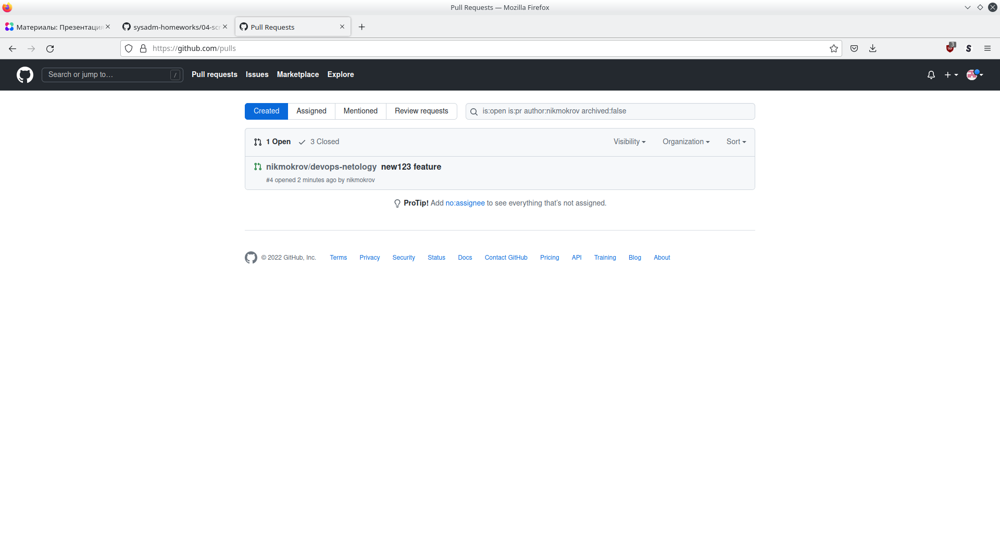
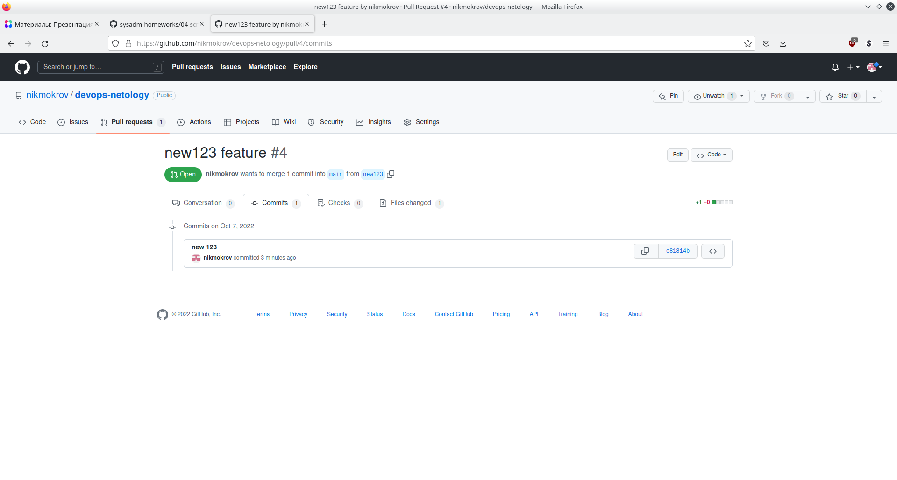

### Как сдавать задания

Вы уже изучили блок «Системы управления версиями», и начиная с этого занятия все ваши работы будут приниматься ссылками на .md-файлы, размещённые в вашем публичном репозитории.

Скопируйте в свой .md-файл содержимое этого файла; исходники можно посмотреть [здесь](https://raw.githubusercontent.com/netology-code/sysadm-homeworks/devsys10/04-script-01-bash/README.md). Заполните недостающие части документа решением задач (заменяйте `???`, ОСТАЛЬНОЕ В ШАБЛОНЕ НЕ ТРОГАЙТЕ чтобы не сломать форматирование текста, подсветку синтаксиса и прочее, иначе можно отправиться на доработку) и отправляйте на проверку. Вместо логов можно вставить скриншоты по желани.

---


# Домашнее задание к занятию "4.1. Командная оболочка Bash: Практические навыки"

## Обязательная задача 1

Есть скрипт:
```bash
a=1
b=2
c=a+b
d=$a+$b
e=$(($a+$b))
```

Какие значения переменным c,d,e будут присвоены? Почему?

| Переменная | Значение | Обоснование                                                                                                                                                                                                    |
|-----------|----------|----------------------------------------------------------------------------------------------------------------------------------------------------------------------------------------------------------------|
| `c`       | a+b      | Переменной 'с' присваивается строка "a+b". а и b в этом случае не переменные, а просто символы.                                                                                                                |
| `d`       | 1+2      | Переменной 'd' также присваивается строка, но благодаря наличию $ идет обращение к a и b, как к переменным, и будут подставлены уже значения соответствующих переменных.                                       |
| `e`       | 3        | Конструкция $(()) указывает, что '+' внутри ее - это арифметическая операция, которую следует выполнить над значениями переменных a и b. Значения переменных в данном случае будут интерпретированы как числа. |


## Обязательная задача 2
На нашем локальном сервере упал сервис и мы написали скрипт, который постоянно проверяет его доступность, записывая дату проверок до тех пор, пока сервис не станет доступным (после чего скрипт должен завершиться). В скрипте допущена ошибка, из-за которой выполнение не может завершиться, при этом место на Жёстком Диске постоянно уменьшается. Что необходимо сделать, чтобы его исправить:
```bash
while ((1==1)
do
	curl https://localhost:4757
	if (($? != 0))
	then
		date >> curl.log
	fi
done
```

### Ваш скрипт:
```bash
#!/usr/bin/bash
while ((1==1))
do
        curl https://localhost:4757
        if (($? != 0))
        then
                date > curl.log
        else
                break
        fi
done
```

## Обязательная задача 3
Необходимо написать скрипт, который проверяет доступность трёх IP: `192.168.0.1`, `173.194.222.113`, `87.250.250.242` по `80` порту и записывает результат в файл `log`. Проверять доступность необходимо пять раз для каждого узла.

### Ваш скрипт:
```bash
#!/usr/bin/bash
arr_ip=(192.168.0.1 173.194.222.113 87.250.250.242)
for j in {1..5}; do
         for i in ${arr_ip[@]}; do
                nc -nvz $i 80 &>> log 
         done
done

```

## Обязательная задача 4
Необходимо дописать скрипт из предыдущего задания так, чтобы он выполнялся до тех пор, пока один из узлов не окажется недоступным. Если любой из узлов недоступен - IP этого узла пишется в файл error, скрипт прерывается.

### Ваш скрипт:
```bash
#!/usr/bin/bash
arr_ip=(192.168.0.1 173.194.222.113 87.250.250.242)
while ((1==1)); do
        for i in ${arr_ip[@]}; do
              nc -nvz $i 80 &>> log 
              if (($? != 0)); then
                    echo $i > error
                    exit
              fi
        done
done

```

## Дополнительное задание (со звездочкой*) - необязательно к выполнению

Мы хотим, чтобы у нас были красивые сообщения для коммитов в репозиторий. Для этого нужно написать локальный хук для git, который будет проверять, что сообщение в коммите содержит код текущего задания в квадратных скобках и количество символов в сообщении не превышает 30. Пример сообщения: \[04-script-01-bash\] сломал хук.

### Ваш скрипт:
```bash
#!/usr/bin/bash
if [[ ${#1} -le 30 && $1 =~ ^\[.*\].*$ ]]; then
    echo OK
    exit 0
else
    echo Bad
    exit 1
fi

```


# Домашнее задание к занятию "4.2. Использование Python для решения типовых DevOps задач"

## Обязательная задача 1

Есть скрипт:
```python
#!/usr/bin/env python3
a = 1
b = '2'
c = a + b
```

### Вопросы:
| Вопрос  | Ответ                                                                                                                                                                                               |
| ------------- |-----------------------------------------------------------------------------------------------------------------------------------------------------------------------------------------------------|
| Какое значение будет присвоено переменной `c`?  | Произойдет ошибка "unsupported operand type(s)". a и b присвоены значения разных типов int и str, чтобы операция '+' могда быть выполнена, нужно выполнить преобразование типа одной из переменных. |
| Как получить для переменной `c` значение 12?  | Привести переменную 'a' к типу str. c = str(a) + b                                                                                                                                                  |
| Как получить для переменной `c` значение 3?  | Привести переменную 'b' к типу int.  c = a + int(b)                                                                                                                                                 |

## Обязательная задача 2
Мы устроились на работу в компанию, где раньше уже был DevOps Engineer. Он написал скрипт, позволяющий узнать, какие файлы модифицированы в репозитории, относительно локальных изменений. Этим скриптом недовольно начальство, потому что в его выводе есть не все изменённые файлы, а также непонятен полный путь к директории, где они находятся. Как можно доработать скрипт ниже, чтобы он исполнял требования вашего руководителя?

```python
#!/usr/bin/env python3

import os

bash_command = ["cd ~/netology/sysadm-homeworks", "git status"]
result_os = os.popen(' && '.join(bash_command)).read()
is_change = False
for result in result_os.split('\n'):
    if result.find('modified') != -1:
        prepare_result = result.replace('\tmodified:   ', '')
        print(prepare_result)
        break
```

### Ваш скрипт:
```python
#!/usr/bin/env python3

import os

bash_command = ["cd ~/DEVOPS-22/Homeworks/02-git-01/devops-netology", "git status"]
result_os = os.popen(' && '.join(bash_command)).read()
work_dir = os.popen(bash_command[0] + ' && pwd').read().strip()
is_change = False
for result in result_os.split('\n'):
    if result.find('modified') != -1:
        prepare_result = result.replace('\tmodified:   ', '')
        print(work_dir + '/' + prepare_result.strip())
```

### Вывод скрипта при запуске при тестировании:
```
user@host:~/DEVOPS-22/Homeworks/04-script$ ./task2.py
/home/user/DEVOPS-22/Homeworks/02-git-01/devops-netology/README.md
/home/user/DEVOPS-22/Homeworks/02-git-01/devops-netology/has_been_moved.txt
```

## Обязательная задача 3
1. Доработать скрипт выше так, чтобы он мог проверять не только локальный репозиторий в текущей директории, а также умел воспринимать путь к репозиторию, который мы передаём как входной параметр. Мы точно знаем, что начальство коварное и будет проверять работу этого скрипта в директориях, которые не являются локальными репозиториями.

### Ваш скрипт:
```python
#!/usr/bin/env python3

import os 
import sys

git_dir = sys.argv[1].rstrip('/') if len(sys.argv) > 1 else '.'
bash_command = ["cd " + git_dir, "git status 2>&1"]
fd = os.popen(' && '.join(bash_command))
result_os = fd.read()
exit_code = fd.close()
if exit_code('There is no git repository')
    sys.exit()
work_dir = os.popen(bash_command[0] + ' && pwd').read().strip()
is_change = False
for result in result_os.split('\n'):
    if result.find('modified') != -1:
        prepare_result = result.replace('\tmodified:   ', '')
        print(work_dir + '/' + prepare_result.strip())
```

### Вывод скрипта при запуске при тестировании:
```
user@host:~/DEVOPS-22/Homeworks/04-script$ ./task3.py
There is no git repository

user@host:~/DEVOPS-22/Homeworks/04-script$ ./task3.py '~/DEVOPS-22/Homeworks/02-git-01'
There is no git repository

user@host:~/DEVOPS-22/Homeworks/04-script$ ./task3.py '~/DEVOPS-22/Homeworks/02-git-01/devops-netology/'
/home/user/DEVOPS-22/Homeworks/02-git-01/devops-netology/README.md
/home/user/DEVOPS-22/Homeworks/02-git-01/devops-netology/has_been_moved.txt

```

## Обязательная задача 4
1. Наша команда разрабатывает несколько веб-сервисов, доступных по http. Мы точно знаем, что на их стенде нет никакой балансировки, кластеризации, за DNS прячется конкретный IP сервера, где установлен сервис. Проблема в том, что отдел, занимающийся нашей инфраструктурой очень часто меняет нам сервера, поэтому IP меняются примерно раз в неделю, при этом сервисы сохраняют за собой DNS имена. Это бы совсем никого не беспокоило, если бы несколько раз сервера не уезжали в такой сегмент сети нашей компании, который недоступен для разработчиков. Мы хотим написать скрипт, который опрашивает веб-сервисы, получает их IP, выводит информацию в стандартный вывод в виде: <URL сервиса> - <его IP>. Также, должна быть реализована возможность проверки текущего IP сервиса c его IP из предыдущей проверки. Если проверка будет провалена - оповестить об этом в стандартный вывод сообщением: [ERROR] <URL сервиса> IP mismatch: <старый IP> <Новый IP>. Будем считать, что наша разработка реализовала сервисы: `drive.google.com`, `mail.google.com`, `google.com`.

### Ваш скрипт:
```python
#!/usr/bin/env python3

import socket
from time import sleep

serv_list = ['drive.google.com', 'mail.google.com', 'google.com']
ip_list = [socket.gethostbyname(serv) for serv in serv_list]
serv_dict = dict(zip(serv_list, ip_list))
while True:
    for serv, old_ip in serv_dict.items():
        new_ip = socket.gethostbyname(serv)
        if new_ip != old_ip:
            print(f'ERROR {serv} IP mismatch: {old_ip} {new_ip}')
            serv_dict[serv] = new_ip
        print(f'{serv}-{serv_dict[serv]}')
    sleep(2)
```

### Вывод скрипта при запуске при тестировании:
Прим.: Во время работы скрипта вписал **12.34.56.78 drive.google.com** в _/etc/hosts._

```
user@host:~/DEVOPS-22/Homeworks/04-script$ ./task4.py 
drive.google.com-173.194.222.194
mail.google.com-142.250.74.5
google.com-142.250.74.46
drive.google.com-173.194.222.194
mail.google.com-142.250.74.5
google.com-142.250.74.46
ERROR drive.google.com IP mismatch: 173.194.222.194 12.34.56.78
drive.google.com-12.34.56.78
mail.google.com-142.250.74.5
google.com-142.250.74.46
drive.google.com-12.34.56.78
mail.google.com-142.250.74.5
google.com-142.250.74.46
^CTraceback (most recent call last):
  File "/home/user/DEVOPS-22/Homeworks/04-script/./task4.py", line 18, in <module>
    sleep(2)
KeyboardInterrupt
```

## Дополнительное задание (со звездочкой*) - необязательно к выполнению

Так получилось, что мы очень часто вносим правки в конфигурацию своей системы прямо на сервере. Но так как вся наша команда разработки держит файлы конфигурации в github и пользуется gitflow, то нам приходится каждый раз переносить архив с нашими изменениями с сервера на наш локальный компьютер, формировать новую ветку, коммитить в неё изменения, создавать pull request (PR) и только после выполнения Merge мы наконец можем официально подтвердить, что новая конфигурация применена. Мы хотим максимально автоматизировать всю цепочку действий. Для этого нам нужно написать скрипт, который будет в директории с локальным репозиторием обращаться по API к github, создавать PR для вливания текущей выбранной ветки в master с сообщением, которое мы вписываем в первый параметр при обращении к py-файлу (сообщение не может быть пустым). При желании, можно добавить к указанному функционалу создание новой ветки, commit и push в неё изменений конфигурации. С директорией локального репозитория можно делать всё, что угодно. Также, принимаем во внимание, что Merge Conflict у нас отсутствуют и их точно не будет при push, как в свою ветку, так и при слиянии в master. Важно получить конечный результат с созданным PR, в котором применяются наши изменения. 

### Ваш скрипт:
```python
#!/usr/bin/env python3

import os 
import sys

if len(sys.argv) <= 1:
    print('PR message needed')
    sys.exit()
pr_mess = sys.argv[1].strip('"')
pr_mess = sys.argv[1].strip("'")
git_dir = "~/DEVOPS-22/Homeworks/02-git-01/devops-netology"
bash_command = ["cd " + git_dir, "git checkout -b new123", "git add *", "git commit -m 'new 123'"]
fd = os.popen(' && '.join(bash_command))
fd.close()
bash_command = ["cd " + git_dir, "git checkout main"]
fd = os.popen(' && '.join(bash_command))
fd.close()
bash_command = ["cd " + git_dir, "git push --all"]
fd = os.popen(' && '.join(bash_command))
fd.close()
curl_str = 'curl -X POST -H "Accept: application/vnd.github+json" -H "Authorization: Bearer TOKEN HERE" https://api.github.com/repos/nikmokrov/devops-netology>
fd = os.popen(curl_str)
print(fd.read())
fd.close()

```

### Вывод скрипта при запуске при тестировании:
```
user@host:~/DEVOPS-22/Homeworks/04-script$ ./task5.py 'New123 feature!'
Переключено на новую ветку «new123»
Переключено на ветку «main»
Перечисление объектов: 5, готово.
Подсчет объектов: 100% (5/5), готово.
При сжатии изменений используется до 16 потоков
Сжатие объектов: 100% (3/3), готово.
Запись объектов: 100% (3/3), 286 bytes | 286.00 KiB/s, готово.
Total 3 (delta 2), reused 0 (delta 0), pack-reused 0
remote: Resolving deltas: 100% (2/2), completed with 2 local objects.
To github.com:nikmokrov/devops-netology.git
   c271962..e81814b  new123 -> new123
  % Total    % Received % Xferd  Average Speed   Time    Time     Time  Current
                                 Dload  Upload   Total   Spent    Left  Speed
100 18145  100 18064  100    81  19423     87 --:--:-- --:--:-- --:--:-- 19489
{
  "url": "https://api.github.com/repos/nikmokrov/devops-netology/pulls/4",
  "id": 1080143065,
  "node_id": "PR_kwDOH0ahyc5AYazZ",
  "html_url": "https://github.com/nikmokrov/devops-netology/pull/4",
  "diff_url": "https://github.com/nikmokrov/devops-netology/pull/4.diff",
  "patch_url": "https://github.com/nikmokrov/devops-netology/pull/4.patch",
  "issue_url": "https://api.github.com/repos/nikmokrov/devops-netology/issues/4",
  "number": 4,
  "state": "open",
  "locked": false,
  "title": "new123 feature",
  "user": {
    "login": "nikmokrov",
    "id": 111041678,
    "node_id": "U_kgDOBp5cjg",
    "avatar_url": "https://avatars.githubusercontent.com/u/111041678?v=4",
    "gravatar_id": "",
    "url": "https://api.github.com/users/nikmokrov",
    "html_url": "https://github.com/nikmokrov",
    "followers_url": "https://api.github.com/users/nikmokrov/followers",
    "following_url": "https://api.github.com/users/nikmokrov/following{/other_user}",
    "gists_url": "https://api.github.com/users/nikmokrov/gists{/gist_id}",
    "starred_url": "https://api.github.com/users/nikmokrov/starred{/owner}{/repo}",
    "subscriptions_url": "https://api.github.com/users/nikmokrov/subscriptions",
    "organizations_url": "https://api.github.com/users/nikmokrov/orgs",
    "repos_url": "https://api.github.com/users/nikmokrov/repos",
    "events_url": "https://api.github.com/users/nikmokrov/events{/privacy}",
    "received_events_url": "https://api.github.com/users/nikmokrov/received_events",
    "type": "User",
    "site_admin": false
  },
  "body": "New123 feature!",
  "created_at": "2022-10-07T10:00:20Z",
  "updated_at": "2022-10-07T10:00:20Z",
  "closed_at": null,
  "merged_at": null,
  "merge_commit_sha": null,
  "assignee": null,
  "assignees": [

  ],
  "requested_reviewers": [

  ],
  "requested_teams": [

  ],
  "labels": [

  ],
  "milestone": null,
  "draft": false,
  "commits_url": "https://api.github.com/repos/nikmokrov/devops-netology/pulls/4/commits",
  "review_comments_url": "https://api.github.com/repos/nikmokrov/devops-netology/pulls/4/comments",
  "review_comment_url": "https://api.github.com/repos/nikmokrov/devops-netology/pulls/comments{/number}",
  "comments_url": "https://api.github.com/repos/nikmokrov/devops-netology/issues/4/comments",
  "statuses_url": "https://api.github.com/repos/nikmokrov/devops-netology/statuses/e81814b8133a8bc6c4693ae6f1924af6a03f5c29",
  "head": {
    "label": "nikmokrov:new123",
    "ref": "new123",
    "sha": "e81814b8133a8bc6c4693ae6f1924af6a03f5c29",
    "user": {
      "login": "nikmokrov",
      "id": 111041678,
      "node_id": "U_kgDOBp5cjg",
      "avatar_url": "https://avatars.githubusercontent.com/u/111041678?v=4",
      "gravatar_id": "",
      "url": "https://api.github.com/users/nikmokrov",
      "html_url": "https://github.com/nikmokrov",
      "followers_url": "https://api.github.com/users/nikmokrov/followers",
      "following_url": "https://api.github.com/users/nikmokrov/following{/other_user}",
      "gists_url": "https://api.github.com/users/nikmokrov/gists{/gist_id}",
      "starred_url": "https://api.github.com/users/nikmokrov/starred{/owner}{/repo}",
      "subscriptions_url": "https://api.github.com/users/nikmokrov/subscriptions",
      "organizations_url": "https://api.github.com/users/nikmokrov/orgs",
      "repos_url": "https://api.github.com/users/nikmokrov/repos",
      "events_url": "https://api.github.com/users/nikmokrov/events{/privacy}",
      "received_events_url": "https://api.github.com/users/nikmokrov/received_events",
      "type": "User",
      "site_admin": false
    },
    "repo": {
      "id": 524722633,
      "node_id": "R_kgDOH0ahyQ",
      "name": "devops-netology",
      "full_name": "nikmokrov/devops-netology",
      "private": false,
      "owner": {
        "login": "nikmokrov",
        "id": 111041678,
        "node_id": "U_kgDOBp5cjg",
        "avatar_url": "https://avatars.githubusercontent.com/u/111041678?v=4",
        "gravatar_id": "",
        "url": "https://api.github.com/users/nikmokrov",
        "html_url": "https://github.com/nikmokrov",
        "followers_url": "https://api.github.com/users/nikmokrov/followers",
        "following_url": "https://api.github.com/users/nikmokrov/following{/other_user}",
        "gists_url": "https://api.github.com/users/nikmokrov/gists{/gist_id}",
        "starred_url": "https://api.github.com/users/nikmokrov/starred{/owner}{/repo}",
        "subscriptions_url": "https://api.github.com/users/nikmokrov/subscriptions",
        "organizations_url": "https://api.github.com/users/nikmokrov/orgs",
        "repos_url": "https://api.github.com/users/nikmokrov/repos",
        "events_url": "https://api.github.com/users/nikmokrov/events{/privacy}",
        "received_events_url": "https://api.github.com/users/nikmokrov/received_events",
        "type": "User",
        "site_admin": false
      },
      "html_url": "https://github.com/nikmokrov/devops-netology",
      "description": null,
      "fork": false,
      "url": "https://api.github.com/repos/nikmokrov/devops-netology",
      "forks_url": "https://api.github.com/repos/nikmokrov/devops-netology/forks",
      "keys_url": "https://api.github.com/repos/nikmokrov/devops-netology/keys{/key_id}",
      "collaborators_url": "https://api.github.com/repos/nikmokrov/devops-netology/collaborators{/collaborator}",
      "teams_url": "https://api.github.com/repos/nikmokrov/devops-netology/teams",
      "hooks_url": "https://api.github.com/repos/nikmokrov/devops-netology/hooks",
      "issue_events_url": "https://api.github.com/repos/nikmokrov/devops-netology/issues/events{/number}",
      "events_url": "https://api.github.com/repos/nikmokrov/devops-netology/events",
      "assignees_url": "https://api.github.com/repos/nikmokrov/devops-netology/assignees{/user}",
      "branches_url": "https://api.github.com/repos/nikmokrov/devops-netology/branches{/branch}",
      "tags_url": "https://api.github.com/repos/nikmokrov/devops-netology/tags",
      "blobs_url": "https://api.github.com/repos/nikmokrov/devops-netology/git/blobs{/sha}",
      "git_tags_url": "https://api.github.com/repos/nikmokrov/devops-netology/git/tags{/sha}",
      "git_refs_url": "https://api.github.com/repos/nikmokrov/devops-netology/git/refs{/sha}",
      "trees_url": "https://api.github.com/repos/nikmokrov/devops-netology/git/trees{/sha}",
      "statuses_url": "https://api.github.com/repos/nikmokrov/devops-netology/statuses/{sha}",
      "languages_url": "https://api.github.com/repos/nikmokrov/devops-netology/languages",
      "stargazers_url": "https://api.github.com/repos/nikmokrov/devops-netology/stargazers",
      "contributors_url": "https://api.github.com/repos/nikmokrov/devops-netology/contributors",
      "subscribers_url": "https://api.github.com/repos/nikmokrov/devops-netology/subscribers",
      "subscription_url": "https://api.github.com/repos/nikmokrov/devops-netology/subscription",
      "commits_url": "https://api.github.com/repos/nikmokrov/devops-netology/commits{/sha}",
      "git_commits_url": "https://api.github.com/repos/nikmokrov/devops-netology/git/commits{/sha}",
      "comments_url": "https://api.github.com/repos/nikmokrov/devops-netology/comments{/number}",
      "issue_comment_url": "https://api.github.com/repos/nikmokrov/devops-netology/issues/comments{/number}",
      "contents_url": "https://api.github.com/repos/nikmokrov/devops-netology/contents/{+path}",
      "compare_url": "https://api.github.com/repos/nikmokrov/devops-netology/compare/{base}...{head}",
      "merges_url": "https://api.github.com/repos/nikmokrov/devops-netology/merges",
      "archive_url": "https://api.github.com/repos/nikmokrov/devops-netology/{archive_format}{/ref}",
      "downloads_url": "https://api.github.com/repos/nikmokrov/devops-netology/downloads",
      "issues_url": "https://api.github.com/repos/nikmokrov/devops-netology/issues{/number}",
      "pulls_url": "https://api.github.com/repos/nikmokrov/devops-netology/pulls{/number}",
      "milestones_url": "https://api.github.com/repos/nikmokrov/devops-netology/milestones{/number}",
      "notifications_url": "https://api.github.com/repos/nikmokrov/devops-netology/notifications{?since,all,participating}",
      "labels_url": "https://api.github.com/repos/nikmokrov/devops-netology/labels{/name}",
      "releases_url": "https://api.github.com/repos/nikmokrov/devops-netology/releases{/id}",
      "deployments_url": "https://api.github.com/repos/nikmokrov/devops-netology/deployments",
      "created_at": "2022-08-14T16:25:55Z",
      "updated_at": "2022-08-21T16:57:25Z",
      "pushed_at": "2022-10-07T10:00:19Z",
      "git_url": "git://github.com/nikmokrov/devops-netology.git",
      "ssh_url": "git@github.com:nikmokrov/devops-netology.git",
      "clone_url": "https://github.com/nikmokrov/devops-netology.git",
      "svn_url": "https://github.com/nikmokrov/devops-netology",
      "homepage": null,
      "size": 3352,
      "stargazers_count": 0,
      "watchers_count": 0,
      "language": "Shell",
      "has_issues": true,
      "has_projects": true,
      "has_downloads": true,
      "has_wiki": true,
      "has_pages": false,
      "forks_count": 0,
      "mirror_url": null,
      "archived": false,
      "disabled": false,
      "open_issues_count": 1,
      "license": null,
      "allow_forking": true,
      "is_template": false,
      "web_commit_signoff_required": false,
      "topics": [

      ],
      "visibility": "public",
      "forks": 0,
      "open_issues": 1,
      "watchers": 0,
      "default_branch": "main"
    }
  },
  "base": {
    "label": "nikmokrov:main",
    "ref": "main",
    "sha": "c2719625478818087b9751dbfe3d414b13b902cf",
    "user": {
      "login": "nikmokrov",
      "id": 111041678,
      "node_id": "U_kgDOBp5cjg",
      "avatar_url": "https://avatars.githubusercontent.com/u/111041678?v=4",
      "gravatar_id": "",
      "url": "https://api.github.com/users/nikmokrov",
      "html_url": "https://github.com/nikmokrov",
      "followers_url": "https://api.github.com/users/nikmokrov/followers",
      "following_url": "https://api.github.com/users/nikmokrov/following{/other_user}",
      "gists_url": "https://api.github.com/users/nikmokrov/gists{/gist_id}",
      "starred_url": "https://api.github.com/users/nikmokrov/starred{/owner}{/repo}",
      "subscriptions_url": "https://api.github.com/users/nikmokrov/subscriptions",
      "organizations_url": "https://api.github.com/users/nikmokrov/orgs",
      "repos_url": "https://api.github.com/users/nikmokrov/repos",
      "events_url": "https://api.github.com/users/nikmokrov/events{/privacy}",
      "received_events_url": "https://api.github.com/users/nikmokrov/received_events",
      "type": "User",
      "site_admin": false
    },
    "repo": {
      "id": 524722633,
      "node_id": "R_kgDOH0ahyQ",
      "name": "devops-netology",
      "full_name": "nikmokrov/devops-netology",
      "private": false,
      "owner": {
        "login": "nikmokrov",
        "id": 111041678,
        "node_id": "U_kgDOBp5cjg",
        "avatar_url": "https://avatars.githubusercontent.com/u/111041678?v=4",
        "gravatar_id": "",
        "url": "https://api.github.com/users/nikmokrov",
        "html_url": "https://github.com/nikmokrov",
        "followers_url": "https://api.github.com/users/nikmokrov/followers",
        "following_url": "https://api.github.com/users/nikmokrov/following{/other_user}",
        "gists_url": "https://api.github.com/users/nikmokrov/gists{/gist_id}",
        "starred_url": "https://api.github.com/users/nikmokrov/starred{/owner}{/repo}",
        "subscriptions_url": "https://api.github.com/users/nikmokrov/subscriptions",
        "organizations_url": "https://api.github.com/users/nikmokrov/orgs",
        "repos_url": "https://api.github.com/users/nikmokrov/repos",
        "events_url": "https://api.github.com/users/nikmokrov/events{/privacy}",
        "received_events_url": "https://api.github.com/users/nikmokrov/received_events",
        "type": "User",
        "site_admin": false
      },
      "html_url": "https://github.com/nikmokrov/devops-netology",
      "description": null,
      "fork": false,
      "url": "https://api.github.com/repos/nikmokrov/devops-netology",
      "forks_url": "https://api.github.com/repos/nikmokrov/devops-netology/forks",
      "keys_url": "https://api.github.com/repos/nikmokrov/devops-netology/keys{/key_id}",
      "collaborators_url": "https://api.github.com/repos/nikmokrov/devops-netology/collaborators{/collaborator}",
      "teams_url": "https://api.github.com/repos/nikmokrov/devops-netology/teams",
      "hooks_url": "https://api.github.com/repos/nikmokrov/devops-netology/hooks",
      "issue_events_url": "https://api.github.com/repos/nikmokrov/devops-netology/issues/events{/number}",
      "events_url": "https://api.github.com/repos/nikmokrov/devops-netology/events",
      "assignees_url": "https://api.github.com/repos/nikmokrov/devops-netology/assignees{/user}",
      "branches_url": "https://api.github.com/repos/nikmokrov/devops-netology/branches{/branch}",
      "tags_url": "https://api.github.com/repos/nikmokrov/devops-netology/tags",
      "blobs_url": "https://api.github.com/repos/nikmokrov/devops-netology/git/blobs{/sha}",
      "git_tags_url": "https://api.github.com/repos/nikmokrov/devops-netology/git/tags{/sha}",
      "git_refs_url": "https://api.github.com/repos/nikmokrov/devops-netology/git/refs{/sha}",
      "trees_url": "https://api.github.com/repos/nikmokrov/devops-netology/git/trees{/sha}",
      "statuses_url": "https://api.github.com/repos/nikmokrov/devops-netology/statuses/{sha}",
      "languages_url": "https://api.github.com/repos/nikmokrov/devops-netology/languages",
      "stargazers_url": "https://api.github.com/repos/nikmokrov/devops-netology/stargazers",
      "contributors_url": "https://api.github.com/repos/nikmokrov/devops-netology/contributors",
      "subscribers_url": "https://api.github.com/repos/nikmokrov/devops-netology/subscribers",
      "subscription_url": "https://api.github.com/repos/nikmokrov/devops-netology/subscription",
      "commits_url": "https://api.github.com/repos/nikmokrov/devops-netology/commits{/sha}",
      "git_commits_url": "https://api.github.com/repos/nikmokrov/devops-netology/git/commits{/sha}",
      "comments_url": "https://api.github.com/repos/nikmokrov/devops-netology/comments{/number}",
      "issue_comment_url": "https://api.github.com/repos/nikmokrov/devops-netology/issues/comments{/number}",
      "contents_url": "https://api.github.com/repos/nikmokrov/devops-netology/contents/{+path}",
      "compare_url": "https://api.github.com/repos/nikmokrov/devops-netology/compare/{base}...{head}",
      "merges_url": "https://api.github.com/repos/nikmokrov/devops-netology/merges",
      "archive_url": "https://api.github.com/repos/nikmokrov/devops-netology/{archive_format}{/ref}",
      "downloads_url": "https://api.github.com/repos/nikmokrov/devops-netology/downloads",
      "issues_url": "https://api.github.com/repos/nikmokrov/devops-netology/issues{/number}",
      "pulls_url": "https://api.github.com/repos/nikmokrov/devops-netology/pulls{/number}",
      "milestones_url": "https://api.github.com/repos/nikmokrov/devops-netology/milestones{/number}",
      "notifications_url": "https://api.github.com/repos/nikmokrov/devops-netology/notifications{?since,all,participating}",
      "labels_url": "https://api.github.com/repos/nikmokrov/devops-netology/labels{/name}",
      "releases_url": "https://api.github.com/repos/nikmokrov/devops-netology/releases{/id}",
      "deployments_url": "https://api.github.com/repos/nikmokrov/devops-netology/deployments",
      "created_at": "2022-08-14T16:25:55Z",
      "updated_at": "2022-08-21T16:57:25Z",
      "pushed_at": "2022-10-07T10:00:19Z",
      "git_url": "git://github.com/nikmokrov/devops-netology.git",
      "ssh_url": "git@github.com:nikmokrov/devops-netology.git",
      "clone_url": "https://github.com/nikmokrov/devops-netology.git",
      "svn_url": "https://github.com/nikmokrov/devops-netology",
      "homepage": null,
      "size": 3352,
      "stargazers_count": 0,
      "watchers_count": 0,
      "language": "Shell",
      "has_issues": true,
      "has_projects": true,
      "has_downloads": true,
      "has_wiki": true,
      "has_pages": false,
      "forks_count": 0,
      "mirror_url": null,
      "archived": false,
      "disabled": false,
      "open_issues_count": 1,
      "license": null,
      "allow_forking": true,
      "is_template": false,
      "web_commit_signoff_required": false,
      "topics": [

      ],
      "visibility": "public",
      "forks": 0,
      "open_issues": 1,
      "watchers": 0,
      "default_branch": "main"
    }
  },
  "_links": {
    "self": {
      "href": "https://api.github.com/repos/nikmokrov/devops-netology/pulls/4"
    },
    "html": {
      "href": "https://github.com/nikmokrov/devops-netology/pull/4"
    },
    "issue": {
      "href": "https://api.github.com/repos/nikmokrov/devops-netology/issues/4"
    },
    "comments": {
      "href": "https://api.github.com/repos/nikmokrov/devops-netology/issues/4/comments"
    },
    "review_comments": {
      "href": "https://api.github.com/repos/nikmokrov/devops-netology/pulls/4/comments"
    },
    "review_comment": {
      "href": "https://api.github.com/repos/nikmokrov/devops-netology/pulls/comments{/number}"
    },
    "commits": {
      "href": "https://api.github.com/repos/nikmokrov/devops-netology/pulls/4/commits"
    },
    "statuses": {
      "href": "https://api.github.com/repos/nikmokrov/devops-netology/statuses/e81814b8133a8bc6c4693ae6f1924af6a03f5c29"
    }
  },
  "author_association": "OWNER",
  "auto_merge": null,
  "active_lock_reason": null,
  "merged": false,
  "mergeable": null,
  "rebaseable": null,
  "mergeable_state": "unknown",
  "merged_by": null,
  "comments": 0,
  "review_comments": 0,
  "maintainer_can_modify": false,
  "commits": 1,
  "additions": 1,
  "deletions": 0,
  "changed_files": 1
}
```


