# Дипломный практикум в Yandex.Cloud

## Этапы выполнения:

### Создание облачной инфраструктуры

1. Создаем сервисный аккаунт для управления инфраструктурой с необходимыми правами и S3-бакет для бэкенда:</br>
```console
user@host:~/1-infra/terraform$ YC_TOKEN=$(yc iam create-token) terraform apply -auto-approve
```

2. Инициализируем s3-бэкенд:
```console
user@host:~/2-k8s/terraform$ yc iam key create --service-account-name infra-sa --output key.json
user@host:~/2-k8s/terraform$ export YC_ACCESS_KEY=secret
user@host:~/2-k8s/terraform$ export YC_SECRET_KEY=secret
user@host:~/2-k8s/terraform$ terraform init -backend-config "access_key=$YC_ACCESS_KEY" -backend-config "secret_key=$YC_SECRET_KEY"
```

Прочие ресурсы будут созданы на следующем этапе


### Создание Kubernetes кластера

1. Создаем VPC, subnets,  Kubernetes кластер в сервисе Yandex Managed Service for Kubernetes и Container Registry для хранения сборок тестового приложения:</br>
```console
user@host:~/2-k8s/terraform$ TF_VAR_YC_SA_KEY=$(cat key.json) terraform apply -auto-approve
```

2. Кластер готов:
```console
user@host:~/2-k8s/terraform$ kubectl get pods --all-namespaces
NAMESPACE     NAME                                                  READY   STATUS    RESTARTS       AGE
kube-system   calico-node-jzw6s                                     1/1     Running   0              2m53s
kube-system   calico-node-q5ff7                                     1/1     Running   0              2m36s
kube-system   calico-node-q8l4c                                     1/1     Running   0              2m10s
kube-system   calico-typha-7dc6645875-gmlb5                         1/1     Running   0              97s
kube-system   calico-typha-horizontal-autoscaler-785c94fb55-rkqq4   1/1     Running   0              5m56s
kube-system   calico-typha-vertical-autoscaler-7679879786-brhtm     1/1     Running   3 (2m5s ago)   5m56s
kube-system   coredns-588fbc4947-4xnpz                              1/1     Running   0              2m17s
kube-system   coredns-588fbc4947-77xsh                              1/1     Running   0              5m55s
kube-system   ip-masq-agent-c28pr                                   1/1     Running   0              2m10s
kube-system   ip-masq-agent-rjnlc                                   1/1     Running   0              2m53s
kube-system   ip-masq-agent-t45rh                                   1/1     Running   0              2m36s
kube-system   kube-dns-autoscaler-55c4f55869-7c7wg                  1/1     Running   0              5m50s
kube-system   kube-proxy-6ptl9                                      1/1     Running   0              2m36s
kube-system   kube-proxy-pqnns                                      1/1     Running   0              2m53s
kube-system   kube-proxy-vdqrq                                      1/1     Running   0              2m10s
kube-system   metrics-server-9b4bf686c-lmgz9                        2/2     Running   0              2m16s
kube-system   npd-v0.8.0-rgxqs                                      1/1     Running   0              2m10s
kube-system   npd-v0.8.0-vm64s                                      1/1     Running   0              2m53s
kube-system   npd-v0.8.0-wk54q                                      1/1     Running   0              2m36s
kube-system   yc-disk-csi-node-v2-cfqrt                             6/6     Running   0              2m53s
kube-system   yc-disk-csi-node-v2-k4xw6                             6/6     Running   0              2m36s
kube-system   yc-disk-csi-node-v2-nnx6d                             6/6     Running   0              2m10s

```


### Создание тестового приложения

1. Репозиторий с тестовым приложением:
[clock-app](https://github.com/nikmokrov/clock-app)</br>

2. [Dockerfile](https://github.com/nikmokrov/clock-app/blob/main/Dockerfile)</br>

3. Собираем контейнер с тестовым приложением локально вручную и отправляем его в Container Registry.</br>
На этапе настройки CI/CD данный процесс будет автоматизирован.
```console
user@host:~/3-app$ yc container registry configure-docker

user@host:~/3-app$ docker build -t cr.yandex/crpjp4ujjlrt73g1f32k/clock-app:v0.0.1 -t cr.yandex/crpjp4ujjlrt73g1f32k/clock-app:latest .
user@host:~/3-app$ docker push cr.yandex/crpjp4ujjlrt73g1f32k/clock-app:v0.0.1
user@host:~/3-app$ docker push cr.yandex/crpjp4ujjlrt73g1f32k/clock-app:latest

```

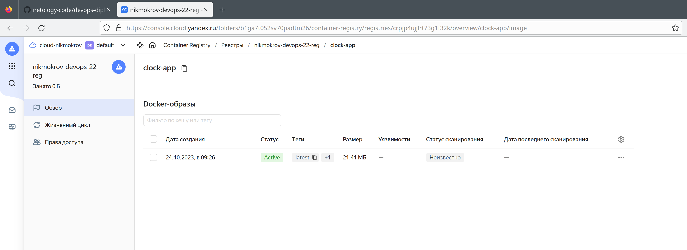


### Подготовка cистемы мониторинга и деплой приложения

1. Деплоим в кластер atlantis</br>
Требуется предварительно собрать собственный образ atlantis, включив в нем настройку зеркала, с которого можно забрать провайдер для Яндекс Облака, экспорт метрик для prometheus, и запушить его в свой же созданный регистр.

```console
user@host:~/4-deploy/1-atlantis$ docker build -t cr.yandex/crpjp4ujjlrt73g1f32k/atlantis:v0.26.0-ya .
user@host:~/4-deploy/1-atlantis$docker push cr.yandex/crpjp4ujjlrt73g1f32k/atlantis:v0.26.0-ya
```

Деплой atlantis в кластер:
```console
user@host:~/4-deploy/1-atlantis$ echo -n "secret" > access_key
user@host:~/4-deploy/1-atlantis$ echo -n "secret" > secret_key
user@host:~/4-deploy/1-atlantis$ echo -n "secret" > token
user@host:~/4-deploy/1-atlantis$ echo -n $(openssl rand -base64 32) > webhook-secret
user@host:~/4-deploy/1-atlantis$ kubectl create ns atlantis
user@host:~/4-deploy/1-atlantis$ kubectl -n atlantis create secret generic atlantis-vcs --from-file=access_key --from-file=secret_key --from-file=token --from-file=webhook-secret --from-file=../../2-k8s/terraform/key.json
user@host:~/4-deploy/1-atlantis$ kubectl apply -f atlantis.yml

```


2. Деплоим в кластер тестовое приложение clock-app с помощью qbec</br>
```console
user@host:~/final/4-deploy/2-clock-app$ qbec validate clock-app
setting cluster to yc-managed-k8s-catu0s04ucokglo4tdb4
setting context to yc-managed-k8s-catu0s04ucokglo4tdb4
cluster metadata load took 592ms
1 components evaluated in 8ms
✔ deployments clock-app -n clock-app (source clock-app) is valid
✔ namespaces clock-app (source clock-app) is valid
✔ services clock-app-svc -n clock-app (source clock-app) is valid
---
stats:
  valid: 3

command took 1.44s

user@host:~/4-deploy/2-clock-app$ qbec apply clock-app
setting cluster to yc-managed-k8s-catu0s04ucokglo4tdb4
setting context to yc-managed-k8s-catu0s04ucokglo4tdb4
cluster metadata load took 618ms
1 components evaluated in 5ms

will synchronize 3 object(s)

Do you want to continue [y/n]: y
1 components evaluated in 6ms
create namespaces clock-app (source clock-app)
create deployments clock-app -n clock-app (source clock-app)
create services clock-app-svc -n clock-app (source clock-app)
waiting for deletion list to be returned
server objects load took 1.641s
---
stats:
  created:
  - namespaces clock-app (source clock-app)
  - deployments clock-app -n clock-app (source clock-app)
  - services clock-app-svc -n clock-app (source clock-app)

waiting for readiness of 1 objects
  - deployments clock-app -n clock-app

  0s    : deployments clock-app -n clock-app :: 0 of 1 updated replicas are available
✓ 5s    : deployments clock-app -n clock-app :: successfully rolled out (0 remaining)

✓ 5s: rollout complete
command took 8.09s

```

3. Деплоим в кластер систему мониторинга.</br>
Мониторинг разворачивается последним, т.к. он настроен на сбор метрик из всех неймспейсов.
Тестовое приложение clock-app умеет отдавать простую статистику в prometheus, поэтому мониторинг корректно подхватит ее.
В мониторинге будут отображаться метрики не только самого кластера, но также и atlantis и тестового приложения.

```console
user@host:~/4-deploy/3-kube-prometheus$ jb init
user@host:~/4-deploy/3-kube-prometheus$ jb install github.com/prometheus-operator/kube-prometheus/jsonnet/kube-prometheus@release-0.12
user@host:~/4-deploy/3-kube-prometheus$ ./build.sh monitoring.jsonnet
user@host:~/4-deploy/3-kube-prometheus$ kubectl apply --server-side -f manifests/setup
user@host:~/4-deploy/3-kube-prometheus$ kubectl apply -f manifests/
user@host:~/4-deploy/3-kube-prometheus$ kubectl apply -f grafana.yml

```

4. Осталось обеспечить доступ снаружи к развернутым приложениям.</br>
Для этого устанавливаем в кластере ingress-контроллер, который будет выполнять функцию внешнего сетевого балансировщика, и деплоим сам ingress</br>

```console
user@host:~/4-deploy/4-ingress$ helm repo add ingress-nginx https://kubernetes.github.io/ingress-nginx
user@host:~/4-deploy/4-ingress$ helm repo update
user@host:~/4-deploy/4-ingress$ helm install ingress-nginx ingress-nginx/ingress-nginx
user@host:~/4-deploy/4-ingress$ yc load-balancer network-load-balancer list
+----------------------+----------------------------------------------+-------------+----------+----------------+------------------------+--------+
|          ID          |                     NAME                     |  REGION ID  |   TYPE   | LISTENER COUNT | ATTACHED TARGET GROUPS | STATUS |
+----------------------+----------------------------------------------+-------------+----------+----------------+------------------------+--------+
| enp65ssbe0f0jlu8p321 | k8s-b6d21f5db748b43cd44d4f17ed31cb47fd709b63 | ru-central1 | EXTERNAL |              2 | enpgpovt6aciaum3240f   | ACTIVE |
+----------------------+----------------------------------------------+-------------+----------+----------------+------------------------+--------+

user@host:~/4-deploy/4-ingress$ kubectl apply -f ingress.yml

```

Стали доступны web-интерфейсы: Grafana, atlantis, приложения clock-app
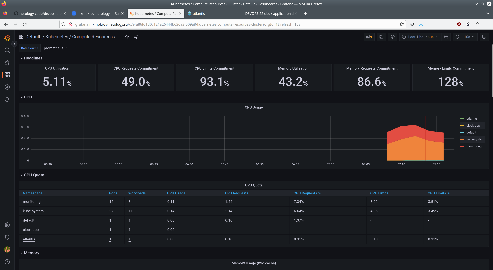
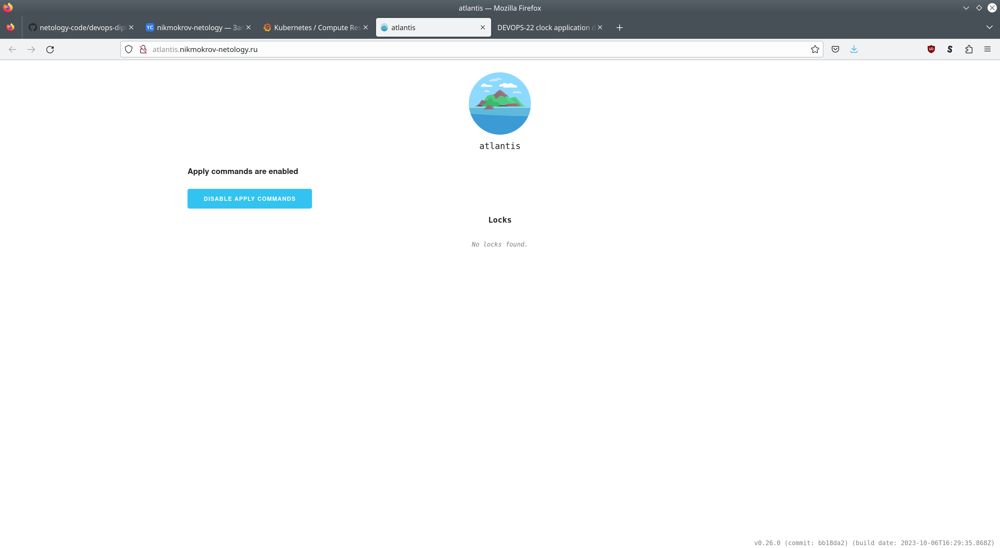
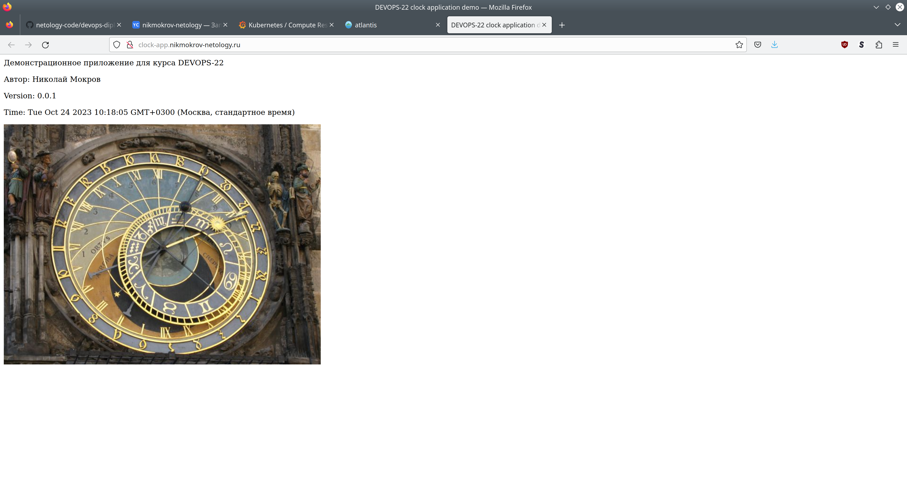

Теперь можно управлять инфраструктурой из GitHub репозитория [ya-infra](https://github.com/nikmokrov/ya-infra) с помощью atlantis.</br>
Настраиваем GitHub Webhooks.

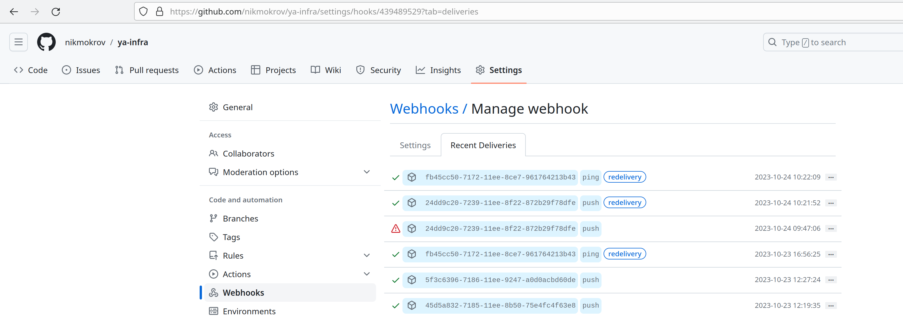

Создаем pull request в репозитории [ya-infra](https://github.com/nikmokrov/ya-infra) и проверяем работу atlantis.

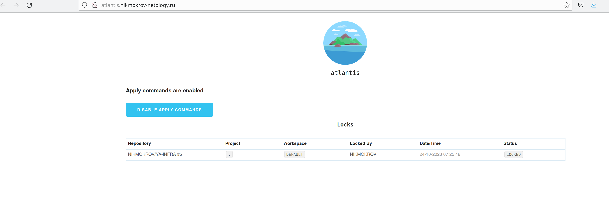
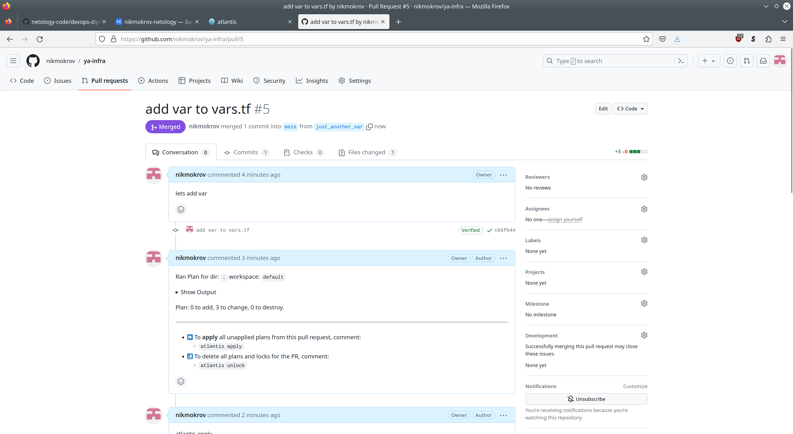
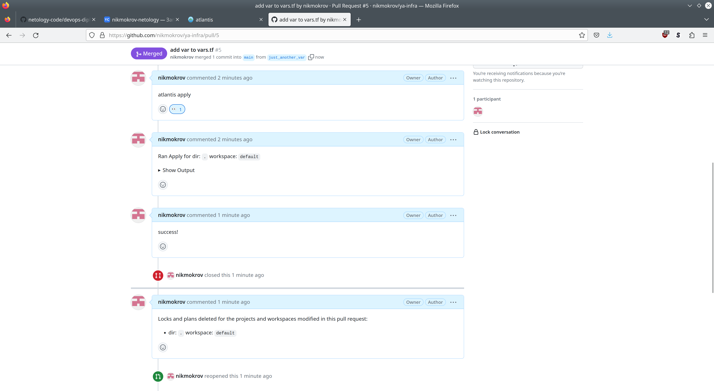
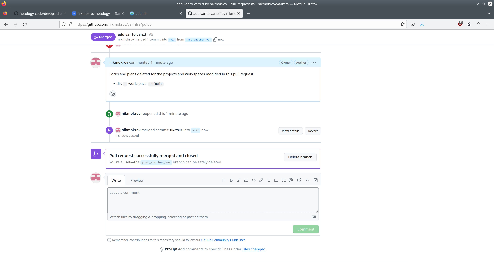


### Установка и настройка CI/CD

1. Создаем в кластере необходимые ресурсы для работы GitHub Actions (Secret, ServiceAccount, ClusterRole и ClusterRoleBinding)
```console
user@host:~/5-cicd$ kubectl apply -f github-actions.yml
user@host:~/5-cicd$ KUBERNETES_SECRET=$(kubectl -n clock-app get secret github-actions-secret -o yaml)
user@host:~/5-cicd$ YCR_JSON_KEY=$(cat ../2-k8s/terraform/key.json)

```

2. Создаем workflow и Actions Secrets (YCR_JSON_KEY и KUBERNETES_SECRET)

[cicd.yml](https://github.com/nikmokrov/clock-app/blob/main/.github/workflows/cicd.yml)</br>

3. Проверяем работу workflow.</br>

[clock-app Actions](https://github.com/nikmokrov/clock-app/actions)

При любом коммите в ветку main, собирается образ приложения clock-app и загружается в Container Registry.</br>
При добавлении тэга, собирается образ с таким же label, загружается в Container Registry и деплоится в кластер.</br>
Метка latest всегда указывает на последний собранный и загруженный образ.

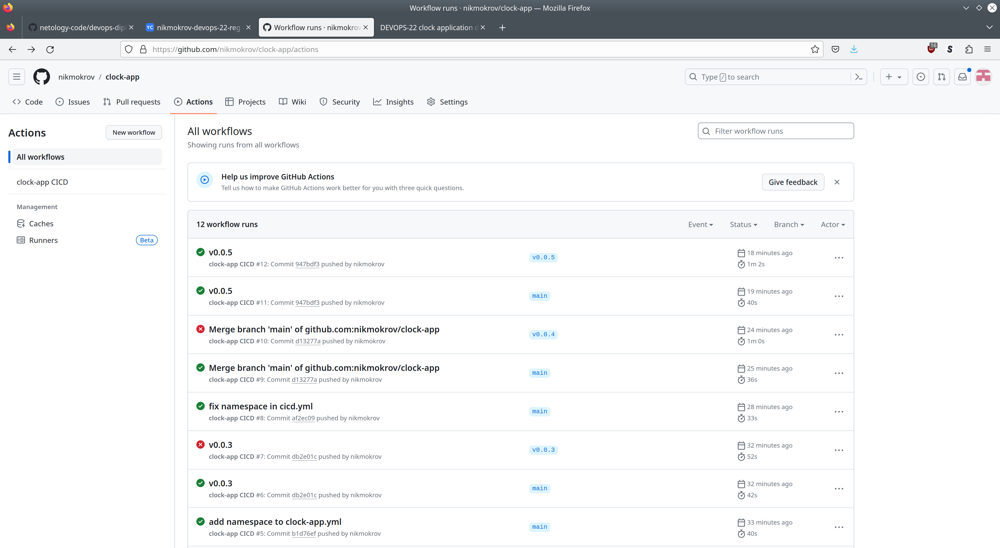
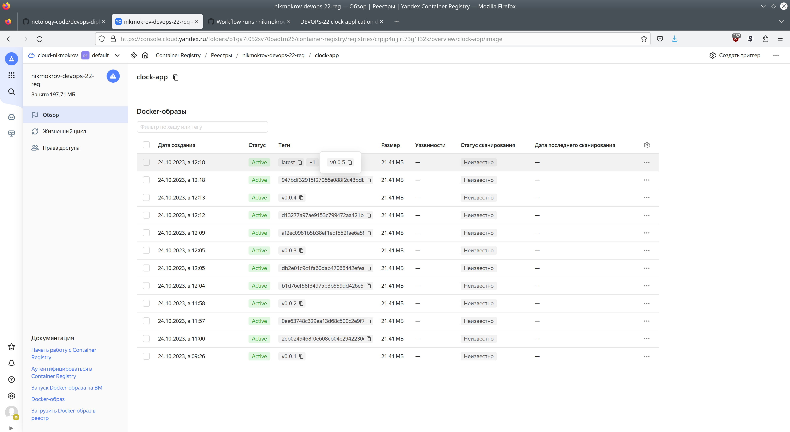
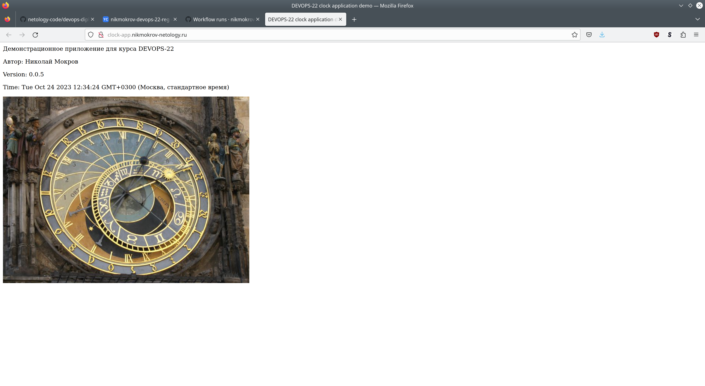


## Ссылки
[Репозиторий со всеми ресурсами](https://github.com/nikmokrov/devops-netology/tree/main/final)</br>
[Репозиторий с конфигурационными файлами Terraform](https://github.com/nikmokrov/ya-infra)</br>
[Пример pull request atlantis](https://github.com/nikmokrov/ya-infra/pull/5)</br>
[Репозиторий тестового приложения clock-app](https://github.com/nikmokrov/clock-app)</br>
[http-доступ к тестовому приложению](http://clock-app.nikmokrov-netology.ru)</br>
[Grafana](http://grafana.nikmokrov-netology.ru) (admin / VerySecret123@!)</br>
