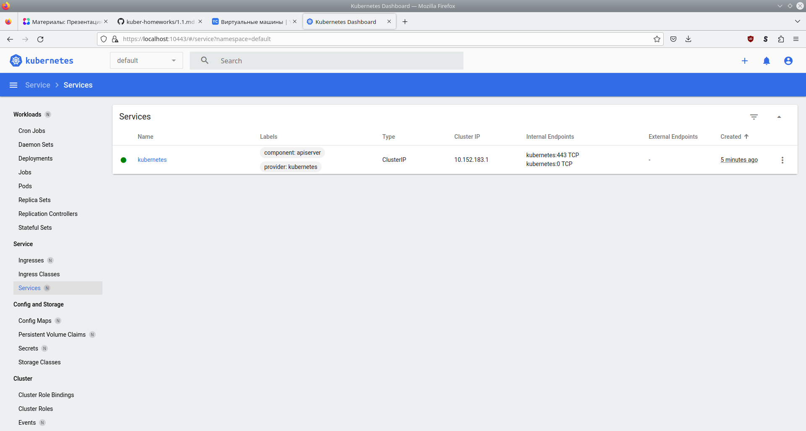

## Домашнее задание к занятию «Kubernetes. Причины появления. Команда kubectl»

# Задание 1. Установка MicroK8S

Создаем ВМ с помощью Terraform</br>
[main.tf](12-kuber/1-kubectl/terraform/main.tf)

Устанавливаем и настраиваем microk8s с помощью Ansible</br>
[site.yml](12-kuber/1-kubectl/playbook/site.yml)

 # Задание 2. Установка и настройка локального kubectl

 ```console
user@host:~$ kubectl version
WARNING: This version information is deprecated and will be replaced with the output from kubectl version --short.  Use --output=yaml|json to get the full version.
Client Version: version.Info{Major:"1", Minor:"26", GitVersion:"v1.26.2", GitCommit:"fc04e732bb3e7198d2fa44efa5457c7c6f8c0f5b", GitTreeState:"clean", BuildDate:"2023-02-22T13:39:03Z", GoVersion:"go1.19.6", Compiler:"gc", Platform:"linux/amd64"}
Kustomize Version: v4.5.7
Server Version: version.Info{Major:"1", Minor:"27", GitVersion:"v1.27.2", GitCommit:"7f6f68fdabc4df88cfea2dcf9a19b2b830f1e647", GitTreeState:"clean", BuildDate:"2023-05-28T05:42:25Z", GoVersion:"go1.20.4", Compiler:"gc", Platform:"linux/amd64"}

user@host:~$ kubectl get nodes
NAME       STATUS   ROLES    AGE     VERSION
microk8s   Ready    <none>   7m27s   v1.27.2

user@host:~$ kubectl port-forward -n kube-system service/kubernetes-dashboard 10443:443

 ```



 