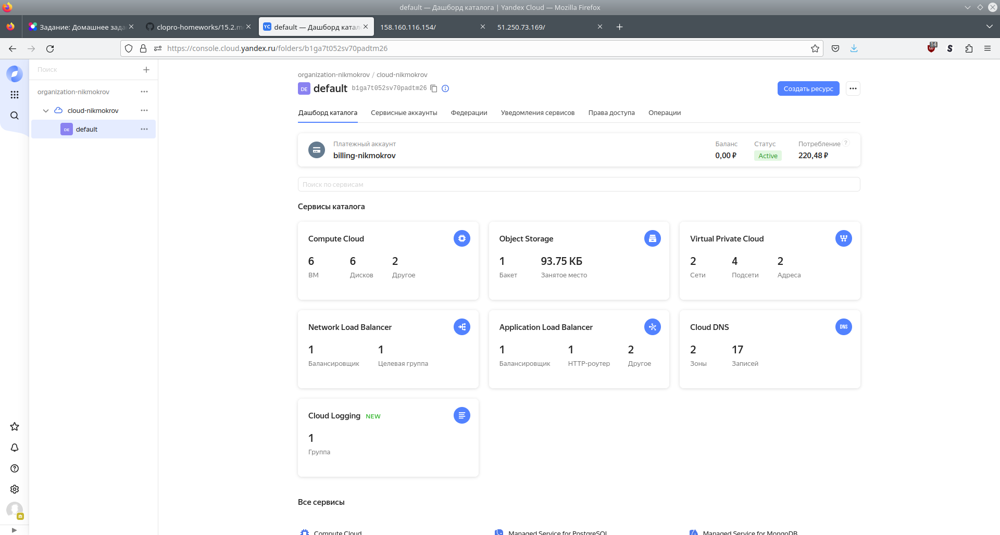
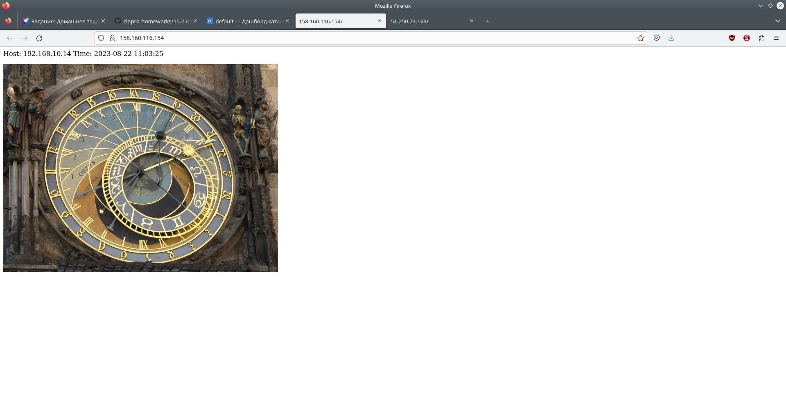
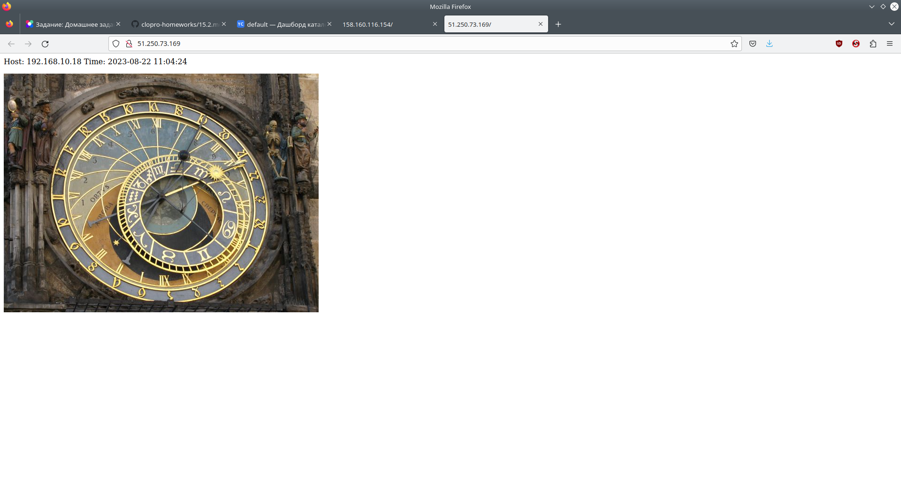

# Домашнее задание к занятию «Вычислительные мощности. Балансировщики нагрузки»

## Задание 1. Yandex Cloud

1. Создать бакет Object Storage и разместить в нём файл с картинкой</br>
[bucket.tf](./13-cloud/2-balancer/bucket.tf) - Bucket</br>

2. Создать группу ВМ в public подсети фиксированного размера с шаблоном LAMP и веб-страницей</br>
[vpc.tf](./13-cloud/2-balancer/vpc.tf) - VPC</br>
[public.tf](./13-cloud/2-balancer/public.tf) - public subnet</br>
[ig.tf](./13-cloud/2-balancer/ig.tf) - Instance Group</br>
[lamp-content.yml](./13-cloud/2-balancer/lamp-content.yml) - Cloud-init файл для настройки LAMP</br>

3. Подключить группу к сетевому балансировщику</br>
[lb.tf](./13-cloud/2-balancer/lb.tf)</br>

4. (дополнительно)* Создать Application Load Balancer</br>
[alb.tf](./13-cloud/2-balancer/alb.tf)</br>

5. Прочие ресурсы Terraform</br>
[main.tf](./13-cloud/2-balancer/main.tf)</br>
[vars.tf](./13-cloud/2-balancer/vars.tf)</br>
[output.tf](./13-cloud/2-balancer/output.tf)</br>

```console
user@host:~$ terraform apply
...
Apply complete! Resources: 12 added, 0 changed, 0 destroyed.
```



```console
user@host:~/Netology/DEVOPS-22/devops-netology/13-cloud/2-balancer$ yc compute instance-group list
+----------------------+--------+--------+------+
|          ID          |  NAME  | STATUS | SIZE |
+----------------------+--------+--------+------+
| cl11mr7phtalgq3phnfh | ig-alb | ACTIVE |    3 |
| cl17nch59godu7gur75f | ig-lb  | ACTIVE |    3 |
+----------------------+--------+--------+------+

user@host:~/Netology/DEVOPS-22/devops-netology/13-cloud/2-balancer$ yc load-balancer nlb list
+----------------------+----------------------------+-------------+----------+----------------+------------------------+--------+
|          ID          |            NAME            |  REGION ID  |   TYPE   | LISTENER COUNT | ATTACHED TARGET GROUPS | STATUS |
+----------------------+----------------------------+-------------+----------+----------------+------------------------+--------+
| enp3rtgadmdqbdhf1e98 | network-load-balancer-lamp | ru-central1 | EXTERNAL |              1 | enpatpqjgifrl0qco64e   | ACTIVE |
+----------------------+----------------------------+-------------+----------+----------------+------------------------+--------+

user@host:~/Netology/DEVOPS-22/devops-netology/13-cloud/2-balancer$ yc application-load-balancer load-balancer list
+----------------------+--------------------------------+-----------+----------------+--------+
|          ID          |              NAME              | REGION ID | LISTENER COUNT | STATUS |
+----------------------+--------------------------------+-----------+----------------+--------+
| ds7d6rn16so9mmpfs4ns | application-load-balancer-lamp |           |              1 | ACTIVE |
+----------------------+--------------------------------+-----------+----------------+--------+
```

IP-адреса ВМ и балансировщиков:
```console
user@host:~/Netology/DEVOPS-22/devops-netology/13-cloud/2-balancer$ yc compute instance list
+----------------------+---------------------------+---------------+---------+-------------+---------------+
|          ID          |           NAME            |    ZONE ID    | STATUS  | EXTERNAL IP |  INTERNAL IP  |
+----------------------+---------------------------+---------------+---------+-------------+---------------+
| epd0csneajop7v6iihqt | cl11mr7phtalgq3phnfh-ufex | ru-central1-b | RUNNING |             | 192.168.10.4  |
| epd3r7g0mhdrupaeloab | cl11mr7phtalgq3phnfh-yzav | ru-central1-b | RUNNING |             | 192.168.10.18 |
| epdgnoi21r7ulsnmislt | cl11mr7phtalgq3phnfh-ycoq | ru-central1-b | RUNNING |             | 192.168.10.11 |
| epdng30tg2e3a1nms1d1 | cl17nch59godu7gur75f-imim | ru-central1-b | RUNNING |             | 192.168.10.14 |
| epdsk0jaomn1u45k46f3 | cl17nch59godu7gur75f-etek | ru-central1-b | RUNNING |             | 192.168.10.7  |
| epdug38g3o50bur23hur | cl17nch59godu7gur75f-udyc | ru-central1-b | RUNNING |             | 192.168.10.8  |
+----------------------+---------------------------+---------------+---------+-------------+---------------+

user@host:~/Netology/DEVOPS-22/devops-netology/13-cloud/2-balancer$ yc vpc address list
+----------------------+-------------------------------+-----------------+----------+------+
|          ID          |             NAME              |     ADDRESS     | RESERVED | USED |
+----------------------+-------------------------------+-----------------+----------+------+
| e9bpjtf4f3jfa0hihtlf |                               | 158.160.116.154 | false    | true |
| e9bpu36b1orheikgieju | alb-ipv4-ds7d6rn16so9mmpfs4ns | 51.250.73.169   | true     | true |
+----------------------+-------------------------------+-----------------+----------+------+

```

Оба балансировщика работают, при обновлении страницы запрос отрабатывают разные хосты, что видно по отображающимся внутренним IP.</br>
Network Load Balancer</br>



Application Load Balancer</br>


