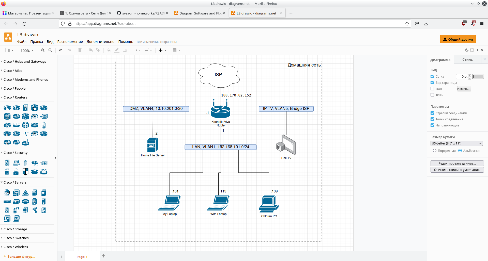

# Ответы на задание к занятию "3.8. Компьютерные сети, лекция 3"
1.
```condsole
route-views>show ip route 188.170.82.152
Routing entry for 188.170.80.0/21
  Known via "bgp 6447", distance 20, metric 0
  Tag 3303, type external
  Last update from 217.192.89.50 1w0d ago
  Routing Descriptor Blocks:
  * 217.192.89.50, from 217.192.89.50, 1w0d ago
      Route metric is 0, traffic share count is 1
      AS Hops 3
      Route tag 3303
      MPLS label: none

route-views>show bgp 188.170.82.152
BGP routing table entry for 188.170.80.0/21, version 2418883052
Paths: (23 available, best #21, table default)
  Not advertised to any peer
  Refresh Epoch 1
  4901 6079 31133 31213, (aggregated by 31213 10.78.104.117)
    162.250.137.254 from 162.250.137.254 (162.250.137.254)
      Origin IGP, localpref 100, valid, external
      Community: 65000:10100 65000:10300 65000:10400
      path 7FE117578B68 RPKI State not found
      rx pathid: 0, tx pathid: 0
  Refresh Epoch 1
  3267 31133 31213, (aggregated by 31213 10.78.104.117)
    194.85.40.15 from 194.85.40.15 (185.141.126.1)
      Origin IGP, metric 0, localpref 100, valid, external
      path 7FE113968528 RPKI State not found
      rx pathid: 0, tx pathid: 0
  Refresh Epoch 1
  8283 31133 31213, (aggregated by 31213 10.78.104.117)
    94.142.247.3 from 94.142.247.3 (94.142.247.3)
      Origin IGP, metric 0, localpref 100, valid, external
      Community: 8283:1 8283:101
      Extended Community: RT:31213:900
      unknown transitive attribute: flag 0xE0 type 0x20 length 0x18
        value 0000 205B 0000 0000 0000 0001 0000 205B
              0000 0005 0000 0001 
      path 7FE0296AFFB0 RPKI State not found
      rx pathid: 0, tx pathid: 0
  Refresh Epoch 1
  20130 6939 31133 31213, (aggregated by 31213 10.78.104.117)
    140.192.8.16 from 140.192.8.16 (140.192.8.16)
      Origin IGP, localpref 100, valid, external
      path 7FE106D1C378 RPKI State not found
      rx pathid: 0, tx pathid: 0
  Refresh Epoch 1
  20912 3257 3356 31133 31213, (aggregated by 31213 10.78.104.117)
    212.66.96.126 from 212.66.96.126 (212.66.96.126)
      Origin IGP, localpref 100, valid, external
      Community: 3257:8070 3257:30515 3257:50001 3257:53900 3257:53902 20912:65004
      path 7FE09A94B360 RPKI State not found
      rx pathid: 0, tx pathid: 0
  Refresh Epoch 1
  49788 12552 31133 31213, (aggregated by 31213 10.78.104.117)
    91.218.184.60 from 91.218.184.60 (91.218.184.60)
      Origin IGP, localpref 100, valid, external
      Community: 12552:12000 12552:12100 12552:12101 12552:22000
      Extended Community: 0x43:100:1
      path 7FE180211B28 RPKI State not found
      rx pathid: 0, tx pathid: 0
  Refresh Epoch 1
  3333 31133 31213, (aggregated by 31213 10.78.104.117)
    193.0.0.56 from 193.0.0.56 (193.0.0.56)
      Origin IGP, localpref 100, valid, external
      Extended Community: RT:31213:900
      path 7FE147AB0530 RPKI State not found
      rx pathid: 0, tx pathid: 0
  Refresh Epoch 1
  6939 31133 31213, (aggregated by 31213 10.78.104.117)
    64.71.137.241 from 64.71.137.241 (216.218.252.164)
      Origin IGP, localpref 100, valid, external
      path 7FE15D127E78 RPKI State not found
      rx pathid: 0, tx pathid: 0
  Refresh Epoch 1
  53767 14315 174 1299 31133 31213, (aggregated by 31213 10.78.104.117)
    162.251.163.2 from 162.251.163.2 (162.251.162.3)
      Origin IGP, localpref 100, valid, external
      Community: 14315:5000 53767:5000
      path 7FE051C89FA0 RPKI State not found
      rx pathid: 0, tx pathid: 0
  Refresh Epoch 1
  7660 2516 1299 31133 31213, (aggregated by 31213 10.78.104.117)
    203.181.248.168 from 203.181.248.168 (203.181.248.168)
      Origin IGP, localpref 100, valid, external
      Community: 2516:1030 7660:9003
      path 7FE101E651C8 RPKI State not found
      rx pathid: 0, tx pathid: 0
  Refresh Epoch 1
  101 3356 31133 31213, (aggregated by 31213 10.78.104.117)
    209.124.176.223 from 209.124.176.223 (209.124.176.223)
      Origin IGP, localpref 100, valid, external
      Community: 101:20100 101:20110 101:22100 3356:2 3356:22 3356:100 3356:123 3356:519 3356:903 3356:2094 65001:1299
      Extended Community: RT:101:22100 RT:31213:900
      path 7FE15E97DBE8 RPKI State not found
      rx pathid: 0, tx pathid: 0
  Refresh Epoch 1
  3561 3910 3356 31133 31213, (aggregated by 31213 10.78.104.117)
    206.24.210.80 from 206.24.210.80 (206.24.210.80)
      Origin IGP, localpref 100, valid, external
      path 7FE15B588E70 RPKI State not found
      rx pathid: 0, tx pathid: 0
  Refresh Epoch 1
  701 1299 31133 31213, (aggregated by 31213 10.78.104.117)
    137.39.3.55 from 137.39.3.55 (137.39.3.55)
      Origin IGP, localpref 100, valid, external
      path 7FE16A710068 RPKI State not found
      rx pathid: 0, tx pathid: 0
  Refresh Epoch 1
  3356 31133 31213, (aggregated by 31213 10.78.104.117)
    4.68.4.46 from 4.68.4.46 (4.69.184.201)
      Origin IGP, metric 0, localpref 100, valid, external
      Community: 3356:2 3356:22 3356:100 3356:123 3356:519 3356:903 3356:2094 65001:1299
      Extended Community: RT:31213:900
      path 7FE050DF1C60 RPKI State not found
      rx pathid: 0, tx pathid: 0
  Refresh Epoch 1
  57866 9002 31133 31213, (aggregated by 31213 10.78.104.117)
    37.139.139.17 from 37.139.139.17 (37.139.139.17)
      Origin IGP, metric 0, localpref 100, valid, external
      Community: 9002:9002 9002:64623
      path 7FE0DA5B6E80 RPKI State not found
      rx pathid: 0, tx pathid: 0
  Refresh Epoch 1
  19214 3257 1299 31133 31213, (aggregated by 31213 10.78.104.117)
    208.74.64.40 from 208.74.64.40 (208.74.64.40)
      Origin IGP, localpref 100, valid, external
      Community: 3257:8108 3257:30391 3257:50002 3257:51200 3257:51203
      path 7FE102BFC348 RPKI State not found
      rx pathid: 0, tx pathid: 0
  Refresh Epoch 1
  1351 6939 31133 31213, (aggregated by 31213 10.78.104.117)
    132.198.255.253 from 132.198.255.253 (132.198.255.253)
      Origin IGP, localpref 100, valid, external
      path 7FE0FD4E0048 RPKI State not found
      rx pathid: 0, tx pathid: 0
  Refresh Epoch 1
  7018 3356 31133 31213, (aggregated by 31213 10.78.104.117)
    12.0.1.63 from 12.0.1.63 (12.0.1.63)
      Origin IGP, localpref 100, valid, external
      Community: 7018:5000 7018:37232
      path 7FE10B9FAFB0 RPKI State not found
      rx pathid: 0, tx pathid: 0
  Refresh Epoch 1
  852 31133 31213, (aggregated by 31213 10.78.104.117)
    154.11.12.212 from 154.11.12.212 (96.1.209.43)
      Origin IGP, metric 0, localpref 100, valid, external
      path 7FE12797CF48 RPKI State not found
      rx pathid: 0, tx pathid: 0
  Refresh Epoch 1
  3549 3356 31133 31213, (aggregated by 31213 10.78.104.117)
    208.51.134.254 from 208.51.134.254 (67.16.168.191)
      Origin IGP, metric 0, localpref 100, valid, external
      Community: 3356:2 3356:22 3356:100 3356:123 3356:519 3356:903 3356:2094 3549:2581 3549:30840
      Extended Community: RT:31213:900
      path 7FE0BDF775E8 RPKI State not found
      rx pathid: 0, tx pathid: 0
  Refresh Epoch 1
  3303 31133 31213, (aggregated by 31213 10.78.104.117)
    217.192.89.50 from 217.192.89.50 (138.187.128.158)
      Origin IGP, localpref 100, valid, external, best
      Community: 0:15169 3303:1004 3303:1006 3303:1030 3303:3056 31133:26149
      path 7FE115F56900 RPKI State not found
      rx pathid: 0, tx pathid: 0x0
  Refresh Epoch 3
  2497 1299 31133 31213, (aggregated by 31213 10.78.104.117)
    202.232.0.2 from 202.232.0.2 (58.138.96.254)
      Origin IGP, localpref 100, valid, external
      path 7FE084AAE6A8 RPKI State not found
      rx pathid: 0, tx pathid: 0
  Refresh Epoch 1
  3257 1299 31133 31213, (aggregated by 31213 10.78.104.117)
    89.149.178.10 from 89.149.178.10 (213.200.83.26)
      Origin IGP, metric 10, localpref 100, valid, external
      Community: 3257:8794 3257:30052 3257:50001 3257:54900 3257:54901
      path 7FE093ACF1B8 RPKI State not found
      rx pathid: 0, tx pathid: 0
```
2.
```console
vagrant@vagrant:~$ sudo modprobe -v dummy numdummies=2
insmod /lib/modules/5.4.0-110-generic/kernel/drivers/net/dummy.ko numdummies=0 numdummies=2

vagrant@vagrant:~$ ip -br link
lo               UNKNOWN        00:00:00:00:00:00 <LOOPBACK,UP,LOWER_UP> 
eth0             UP             08:00:27:a2:6b:fd <BROADCAST,MULTICAST,UP,LOWER_UP> 
dummy0           DOWN           8a:b5:89:d7:16:26 <BROADCAST,NOARP> 
dummy1           DOWN           5a:e6:95:e1:a1:b8 <BROADCAST,NOARP> 

vagrant@vagrant:~$ sudo ip link set dev dummy0 up

vagrant@vagrant:~$ sudo ip link set dev dummy1 up

vagrant@vagrant:~$ ip -br link
lo               UNKNOWN        00:00:00:00:00:00 <LOOPBACK,UP,LOWER_UP> 
eth0             UP             08:00:27:a2:6b:fd <BROADCAST,MULTICAST,UP,LOWER_UP> 
dummy0           UNKNOWN        8a:b5:89:d7:16:26 <BROADCAST,NOARP,UP,LOWER_UP> 
dummy1           UNKNOWN        5a:e6:95:e1:a1:b8 <BROADCAST,NOARP,UP,LOWER_UP> 

vagrant@vagrant:~$ sudo ip route add 172.16.31.0/24 dev dummy0 

vagrant@vagrant:~$ sudo ip route add 172.16.32.0/24 dev dummy1 

vagrant@vagrant:~$ sudo ip route show
default via 10.0.2.2 dev eth0 proto dhcp src 10.0.2.15 metric 100 
10.0.2.0/24 dev eth0 proto kernel scope link src 10.0.2.15 
10.0.2.2 dev eth0 proto dhcp scope link src 10.0.2.15 metric 100 
172.16.31.0/24 dev dummy0 scope link 
172.16.32.0/24 dev dummy1 scope link 
```
3.
```console
vagrant@vagrant:~$ sudo netstat -antp
Active Internet connections (servers and established)
Proto Recv-Q Send-Q Local Address           Foreign Address         State       PID/Program name    
tcp        0      0 127.0.0.53:53           0.0.0.0:*               LISTEN      667/systemd-resolve 
tcp        0      0 0.0.0.0:22              0.0.0.0:*               LISTEN      750/sshd: /usr/sbin 
tcp        0      0 10.0.2.15:22            10.0.2.2:34298          ESTABLISHED 1291/sshd: vagrant  
tcp6       0      0 :::22                   :::*                    LISTEN      750/sshd: /usr/sbin 
```
Сейчас на хосте открыто 2 TCP порта:</br>
- 53 порт DNS открыт службой _systemd-resolved_ только на **loopback**-интерфейсе для обслуживания DNS запросов от самого хоста.</br>
- 22 порт открыт на всех интрефейсах по протоколам IPv4 и IPv6 службой _sshd_ - secure shell для удаленного доступа к данному хосту.</br>
Есть одно установленное соединение на 22 порт от хоста 10.0.2.2 (с порта 34298) - ssh с моего компьютера на виртуальную машину.</br>

4.
```console
vagrant@vagrant:~$ sudo netstat -anup
Active Internet connections (servers and established)
Proto Recv-Q Send-Q Local Address           Foreign Address         State       PID/Program name    
udp        0      0 127.0.0.53:53           0.0.0.0:*                           667/systemd-resolve 
udp        0      0 10.0.2.15:68            0.0.0.0:*                           634/systemd-network 
```
Видим 2 UDP порта:</br>
- Тот же 53 порт DNS, открытый _systemd-resolved_ на **loopback**.</br>
- Порт 68 открыт службой _systemd-networkd_ на интерфейсе **eth0**, это клиентская часть DHCP для приема сообщений от DHCP сервера.</br>

5.
