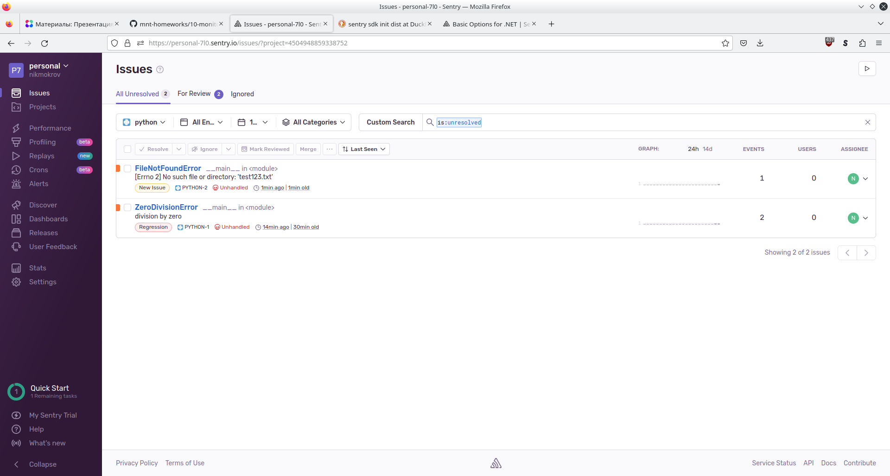

# Домашнее задание к занятию 16 «Платформа мониторинга Sentry»
## Задание 1


## Задание 2


## Задание 3


## Задание повышенной сложности



[sentry_test.py](10-monitoring/05-sentry/sentry_test.py)</br>

```python
#!/usr/bin/python3

import sentry_sdk
sentry_sdk.init(
    dsn="https://8d72dad0518f42219038ed399eff3ea0@o4504948857110528.ingest.sentry.io/4504948859338752",

    traces_sample_rate=1.0,
    release="0.0.1",
    environment="dev",
    dist="python 3.9"
)

with open('test123.txt', 'r') as file:
    content = file.readlines()
    print(content)

```